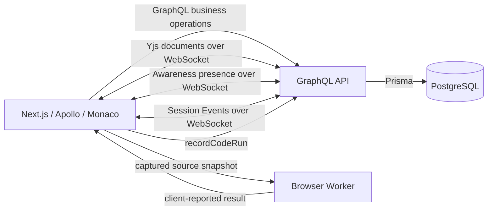

# CodeMeet

**Collaborative technical interviews with a shared Monaco editor, guest invites and persisted run history.**

**Explore:** [Architecture](docs/architecture.md) · [Verification report](docs/phase-12-report.md)

CodeMeet is a web app for running technical interviews. An interviewer selects reusable coding questions, invites a candidate, and works with them in a shared editor. After the session, the interviewer can review persisted run history and a descriptive interview summary.

The project explores the product and architecture problems behind collaborative interviews: keeping business state separate from shared code, controlling guest access, making reconnects converge, and recording useful history without pretending that browser execution is a trusted judge.

## What works today

- Question library and interview setup with frozen question snapshots at session start.
- One-time guest invite and server-authorized candidate session.
- Monaco editor with JavaScript, TypeScript and React/TSX editing.
- Question-scoped Yjs collaboration, participant presence, remote cursors and selections.
- Realtime active-question changes and interview finish notifications.
- JavaScript and standalone TypeScript execution in a terminable browser Worker.
- Persisted, read-only CodeRun history and an owner-only Results page with question snapshots and a session timeline.

React/TSX execution is not implemented. A CodeRun `SUCCESS` records what the browser reported; **SUCCESS does not mean that the candidate solved the question**.

## Stack

- Node.js `>=22.15.0 <23`, pnpm `10.34.6`, Turborepo 2.
- Next.js 16 App Router, React 19, TypeScript 5.9.
- GraphQL Yoga 5, GraphQL Codegen 7, Apollo Client 4.
- PostgreSQL 17, Prisma 7 with the PostgreSQL adapter.
- Monaco Editor, Yjs, y-websocket, y-monaco and Awareness.
- Jest 30, React Testing Library, MSW 3, ESLint 9 and Prettier 3.

## Architecture at a glance



- **GraphQL + PostgreSQL** persist interviews, participants, frozen questions, events, CodeRuns and Results source data.
- **Yjs** synchronizes collaborative source text; **Awareness** carries ephemeral presence and remote cursor/selection state.
- **Session Events** announce committed business-state changes. Clients refetch canonical GraphQL state after an event or reconnect.
- **Browser Worker** runs a captured JavaScript/TypeScript source snapshot away from the UI thread and can be terminated on timeout.
- **CodeRun** stores a browser-reported run and source snapshot. It is history, not trusted execution evidence.
- **Results** derives a descriptive summary from persisted interview state; it does not score or judge candidates.

More detail: [architecture](docs/architecture.md) and [phase reports](docs/phase-1-report.md).

## Local setup

Prerequisites: Node.js `>=22.15.0 <23`, Corepack with pnpm `10.34.6`, and Docker Desktop with the Compose plugin. `.nvmrc` selects the Node 22 line; when using nvm run `nvm install && nvm use`, then confirm `node -v` is at least v22.15.0.

```sh
corepack pnpm --version
cp .env.example .env
```

Edit the local `.env` password and keep `POSTGRES_PASSWORD`, `DATABASE_URL` and `TEST_DATABASE_URL` in sync. These values are development-only; do not put real credentials in `.env.example` or commit `.env`.

```sh
corepack pnpm install --frozen-lockfile
docker compose up -d postgres
docker compose ps
corepack pnpm db:validate
corepack pnpm db:generate
corepack pnpm db:migrate
corepack pnpm db:seed
corepack pnpm dev
```

The Compose service starts PostgreSQL 17 on `127.0.0.1:${POSTGRES_PORT:-5432}` and waits for its health check. It creates the separate `codemeet_test` database when initializing a new volume. `db:migrate` applies checked-in migrations; it does not reset the database. `db:seed` is safe to rerun for the demo records.

The root dev command starts the API and web app through the existing workspace scripts:

- Frontend: <http://localhost:3000>
- GraphQL: <http://127.0.0.1:4000/graphql>
- API health: <http://127.0.0.1:4000/health>
- Collaboration WebSocket: `ws://127.0.0.1:4000/collaboration`
- Session Events WebSocket: `ws://127.0.0.1:4000/session-events/<interviewId>`

Useful existing scripts: `corepack pnpm dev`, `corepack pnpm test`, `corepack pnpm check`, `corepack pnpm build`, `corepack pnpm db:validate`, `corepack pnpm db:generate`, `corepack pnpm db:migrate`, and `corepack pnpm db:seed`. PostgreSQL-backed API tests require the separate `_test` database configured by `TEST_DATABASE_URL`.

The seeded workspace includes the local demo interviewer (`demo@codemeet.local`), three sample questions and a DRAFT demo interview with two questions. The demo interviewer is a shared development identity, not a real login.

## Main routes

| Page                                   | Route                                                                      |
| -------------------------------------- | -------------------------------------------------------------------------- |
| Dashboard                              | `/dashboard` (also `/`)                                                    |
| Question library / create question     | `/questions`, `/questions/new`                                             |
| Create interview                       | `/interviews/new`                                                          |
| Interview overview / session / Results | `/interviews/<id>`, `/interviews/<id>/session`, `/interviews/<id>/results` |
| Candidate invite and join              | `/join/<invite-token>`                                                     |

## 5–10 minute demo flow

1. Open **Dashboard** and **Question library** to show the seeded workspace.
2. Create an interview, give it a readable title, and attach at least two questions.
3. Open its overview, start the interview, and create a guest invite.
4. In a second browser profile or private window, open the invite and join as a candidate with a display name.
5. Open the interviewer session. Show both participants, edit from each window, and point out the remote cursor/selection.
6. Switch the active question and show that the candidate follows; reconnect after a brief network interruption to demonstrate canonical resync.
7. Run a JavaScript or standalone TypeScript snippet. Optionally show a runtime error and timeout; explain that the Worker can be terminated.
8. Open Run History and refresh to show persisted records. Finish the interview, open **Results**, and refresh to show the persisted summary and timeline.

For a short demo, avoid spending time on seed setup or database tooling. Keep the candidate and interviewer in separate browser contexts because candidate identity is tab-scoped.

## Security and trust boundaries

- Interviewer access currently uses **TEMP DEMO AUTH**: every local business request without a candidate bearer uses the same seeded interviewer. It is rejected in production mode and is not production authentication.
- Guest invite and participant session credentials are random opaque tokens; the API stores token hashes. Candidate identity is resolved server-side and scoped to its interview. The raw participant session token is held in that tab's `sessionStorage`.
- The API checks role, membership, interview/question ownership and session validity for business operations and realtime joins. Results and source history are owner-authorized server-side.
- User code executes only in a separate browser Worker, never in the API process. Worker isolation, CSP and `connect-src 'none'` reduce exposure but are **not a hardened sandbox** or a guarantee against hostile code, browser bugs, memory exhaustion, or all same-origin capabilities.
- Run status, output and source submitted by the browser are client-reported. `SUCCESS` is not a trusted judge verdict.
- Source snapshots and output are persisted for run history and Results. Production use needs an explicit retention and deletion policy.

## Known limitations and future work

- Interviewer authentication is a shared demo identity; multi-user production ownership is not ready.
- Yjs documents and Awareness rooms live in the API process; Yjs state is lost when that process restarts. Session Events are best-effort in-process fanout, with canonical refetch on reconnect but no durable event queue or multi-replica routing.
- Code execution supports one JavaScript or standalone TypeScript file. It has no Node APIs, package installation, stdin, React preview, hard memory quota, or trusted server verification. TypeScript is transpiled, not type-checked.
- Run history/Results preserve browser-reported source and output; offline run persistence is not queued. Results show descriptive events, not scores or private notes. The timeline is bounded to the latest 100 key events.
- Production deployment, stronger authentication, hardened remote execution, durable Yjs storage, multi-replica realtime, private notes and trusted judging are future work—not current capabilities.

## Portfolio / interview talking points

- Collaborative editing with Yjs and question-scoped document lifecycle.
- Awareness presence/cursors kept separate from persistent business data.
- Session Events emitted after database commit, with reconnect refetch for canonical state.
- Guest authorization and participant-scoped access enforced by the API.
- Captured source snapshots executed in a terminable browser Worker.
- Persisted, idempotent CodeRun history and Results derived from frozen interview snapshots.
- Integration coverage for PostgreSQL transactions, authorization, concurrency and realtime transports, alongside frontend behavior tests.

These points describe implemented behavior; they do not imply production authentication, hardened sandboxing, a trusted judge, or durable collaboration storage.

## Status and reports

PHASE 0–12 are complete. The PHASE 12 report records final manual smoke verification as PASS. The implementation and check results for each phase are recorded in [`docs/phase-12-report.md`](docs/phase-12-report.md) and the linked historical phase reports.
