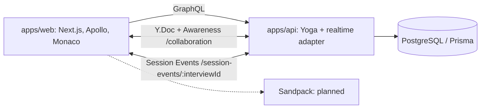

# CodeMeet

CodeMeet — fullstack pet-project для технических интервью с совместным редактированием кода. Интервьюер выбирает задачи и приглашает кандидата по гостевой ссылке. Сейчас участники одной активной Question room видят общий редактор, присутствие, курсоры и выделения. Запуск кода, приватные заметки и результат интервью остаются в roadmap.

Проект имеет собственный интерфейс и не использует дизайн, тексты или branding других платформ.

## Текущий этап

**PHASE 8 — Realtime Session Events — завершена; manual browser smoke PASS.** Подключённые участники получают Interview-scoped уведомления о смене активного вопроса и завершении интервью. После уведомления клиент перечитывает canonical Interview через GraphQL, поэтому persistent business state остаётся в PostgreSQL. Interviewer пока использует TEMP DEMO AUTH; durable Yjs persistence, Auth.js и запуск кода остаются будущей работой.

В репозитории настроены pnpm, Turborepo, TypeScript strict, ESLint и Prettier. Будущие библиотеки устанавливаются тогда, когда для них появляется функциональность.

## Возможности целевого MVP

- Авторизация интервьюера и библиотека reusable задач с поиском и фильтрами.
- Создание интервью, выбор задач и гостевой вход кандидата без регистрации.
- Monaco Editor с JavaScript, TypeScript и React/TSX; Yjs collaboration и remote cursors.
- Presence, reconnect и синхронизация документов после краткого отключения.
- Browser execution, console и React preview; результаты запуска доступны обоим участникам.
- Приватные заметки с backend authorization; итоговая страница с snapshots, runs и timeline.

Эти пункты являются roadmap, а не уже доступными функциями.

## Архитектура

Для MVP выбран модульный Node.js API с GraphQL и WebSocket в одном процессе. Это упрощает передачу бизнес-событий после SQL transaction и сохранение финальных документов. Интерфейс работает в отдельном Next.js приложении. Выделение realtime в третий процесс потребует координации комнат, событий и snapshots; оно отложено до потребности в независимом масштабировании.

GraphQL/PostgreSQL обслуживает persistent business state. Два отдельных WebSocket endpoint на одном API HTTP server обслуживают Question-scoped Yjs/Awareness и Interview-scoped Session Events:



Подробные решения, auth boundaries, persistence и обработка гонок: [docs/architecture.md](docs/architecture.md).

### Guest invite и participant session

На overview экране интервьюер создаёт одноразовую ссылку на `/join/<token>`. В БД сохраняется только SHA-256 hash invite; срок действия — 48 часов, invite использует один кандидат. После ввода имени GraphQL `joinInterview` атомарно создаёт `InterviewParticipant`, hash participant-session и `CANDIDATE_JOINED` event. Candidate token действует 7 дней.

Raw participant token хранится в `sessionStorage` текущей вкладки: он переживает refresh, но не становится постоянным общим browser credential как при `localStorage`. Apollo отправляет его в `Authorization: Bearer` header; WebSocket передаёт token первым application message, не в URL. Candidate видит только присоединённый interview и frozen task snapshot; API блокирует dashboard/library queries, interviewer mutations и доступ к другим interview. Кандидат не может переключать active question или завершить интервью.

Это authentication/identity, а не полное равенство с production authentication: interviewer identity всё ещё общий TEMP DEMO AUTH principal и не защищает чужого пользователя. Candidate session проверяется по hash, сроку, отзыву и participant membership.

### Collaborative editing and session events

`NEXT_PUBLIC_REALTIME_URL` задаёт базовый WebSocket URL, например `ws://127.0.0.1:4000` для разработки и `wss://<host>` за production TLS proxy. Из него frontend строит отдельные endpoints `/collaboration` и `/session-events/:interviewId`. Настройте его в root `.env` вместе с `NEXT_PUBLIC_GRAPHQL_URL`; Next.js встраивает оба публичных URL при запуске/build. Compose поднимает только PostgreSQL, а GraphQL и оба WebSocket endpoint запускаются одним `apps/api` процессом.

В session статус редактора показывает `Connecting…`, `Connected`, `Reconnecting…` или `Disconnected`. Участники текущей Question room видны в компактном списке Participants; y-monaco синхронизирует selection, а editor показывает цветной remote caret с display name. Цвет стабильно выводится из participantId, а несколько вкладок одного participant объединяются в списке. Код, presence и cursors проходят через WebSocket; typing не запускает GraphQL mutation. Provider отключает BroadcastChannel, чтобы обмен шёл через API. API проверяет Origin, participant session, роль, membership, принадлежность interview/question и `IN_PROGRESS` до синхронизации; client-supplied Awareness identity заменяется серверной.

Refresh получает текущий Yjs document, пока API process работает. При перезапуске API комнаты очищаются и редактор возвращается к постоянному `snapshotStarterCode`: PHASE 5 не сохраняет Yjs documents в PostgreSQL. Текущие изменения доступны только в памяти активного API процесса.

Session Events передают только invalidation-уведомления: `ACTIVE_QUESTION_CHANGED` и `INTERVIEW_FINISHED`. После успешного commit GraphQL mutation API публикует событие подключённым участникам того же Interview. Candidate автоматически refetches Interview через Apollo и использует существующий question-switch lifecycle; после finish приходит canonical `FINISHED` state и collaboration закрывается. Reconnect тоже refetches Interview, поэтому потерянное эфемерное уведомление не оставляет старое состояние. Повторный echo инициатору безопасен: одинаковый canonical state не создаёт повторный room lifecycle.

```text
setActiveQuestion → GraphQL → PostgreSQL commit → Session Event
  → Candidate → Apollo canonical refetch → Question room switch
```

Persistent business state хранится в GraphQL/PostgreSQL. Collaborative text проходит через Yjs. Presence, cursor и selection проходят через Awareness. Session Events только сообщают, что Interview изменился; они не являются source of truth, очередью или replay log.

Подробная реализация и результаты проверок: [PHASE 5](docs/phase-5-report.md), [PHASE 6](docs/phase-6-report.md), [PHASE 7](docs/phase-7-report.md) и [PHASE 8](docs/phase-8-report.md).

### Структура репозитория

```text
apps/
  api/
    src/
      index.ts               # запуск и graceful shutdown
      server.ts              # GET /health и Yoga /graphql на одном server
      graphql/
        schema.graphql       # schema-first SDL
        schema.ts
        resolvers.ts
        context.ts           # TEMP DEMO AUTH boundary
        errors.ts
        yoga.ts
      services/
        question.service.ts
        interview.service.ts
        shared.ts            # validation и transaction retry
    scripts/copy-schema.mjs
    tests/
      graphql.integration.test.mjs
      cors.test.mjs
      support/database.mjs
    jest.config.mjs
    eslint.config.mjs
    package.json
    tsconfig.json
    tsconfig.build.json
  web/
    src/
      app/
        layout.tsx           # Server Component + provider boundary
        AppShell.tsx
        page.tsx             # redirect /dashboard
        dashboard/page.tsx
        questions/page.tsx
        questions/new/page.tsx
        interviews/new/page.tsx
        interviews/[id]/page.tsx
        interviews/[id]/session/page.tsx
        globals.css
      features/
        questions/           # list, form, validation, domain operations
          api/questions.graphql
        interviews/          # dashboard, creation, summary, session, status actions
          editor/            # Monaco adapter, models, drafts, Reset confirmation
          api/interviews.graphql
      shared/
        api/                 # Apollo factory/provider/cache/errors
          generated/graphql.ts # Codegen output, хранится в repository
        ui/                  # feedback, icons, styles
        lib/                 # display formatting
    tests/                   # Jest + RTL + MSW GraphQL
    scripts/next.mjs         # root .env через Node loadEnvFile, затем Next CLI
    scripts/build-monaco-workers.mjs # локальные editor/TypeScript workers
    jest.config.mjs
    codegen.ts
    eslint.config.mjs
    next-env.d.ts
    next.config.ts
    package.json
    tsconfig.json
packages/
  db/
    prisma/
      schema.prisma
      migrations/20261001000000_phase_1/migration.sql
      migrations/20261002000000_phase_3/migration.sql
      migrations/migration_lock.toml
      seed.ts
    src/
      client.ts
      index.ts
      seed-data.ts
      generated/             # Prisma output, не хранится в Git
    prisma.config.ts
    package.json
    eslint.config.mjs
    tsconfig.json
    tsconfig.build.json
  config/
    tsconfig/
      base.json
      next.json
      node.json
    eslint.mjs
    eslint.config.mjs
    package.json
docs/
  architecture.md
  phase-1-report.md
  phase-2-report.md
  phase-3-report.md
  phase-4-report.md
docker/postgres/init-test-db.sql
docker-compose.yml
AGENTS.md                    # guidance, добавленный Turborepo
.editorconfig
.env.example
.gitignore
.npmrc
.nvmrc
.prettierignore
.prettierrc.json
eslint.config.mjs
package.json
pnpm-lock.yaml
pnpm-workspace.yaml
turbo.json
README.md
```

`packages/db` содержит серверные Prisma schema/client, миграцию и seed и не импортируется в browser. Единственный SDL находится в `apps/api`; Codegen читает этот локальный файл. Frontend operations и generated documents принадлежат `apps/web`, поэтому дополнительный `packages/graphql` пока не нужен. `packages/shared` добавляется при появлении реально общих контрактов. Пустые слои `entities/widgets` не создаются.

## Tech stack

| Уже используется                                       | Запланировано  |
| ------------------------------------------------------ | -------------- |
| Node.js 22, pnpm 10, Turborepo 2                       | Auth.js        |
| Next.js 16 App Router, React 19                        |                |
| TypeScript 5.9 strict, ESLint 9, Prettier 3            |                |
| Monaco Editor, @monaco-editor/react, локальные workers |                |
| Yjs, y-websocket, y-monaco, y-protocols Awareness      |                |
| PostgreSQL 17, Prisma 7, adapter-pg                    | Sandpack       |
| GraphQL Yoga 5, GraphQL 16, backend Zod 4              | GitHub Actions |
| Apollo Client 4, GraphQL Codegen 7                     |                |
| React Hook Form 7, frontend Zod 4                      |                |
| Jest 30, RTL, MSW 3, Docker Compose PostgreSQL         |                |

Прямые зависимости закреплены точными версиями; transitive dependencies фиксирует `pnpm-lock.yaml`.

## Local setup

Требуются Node.js **22.15+ в ветке 22**, pnpm **10.34.6**, Docker с Compose plugin. При использовании nvm выполните `nvm install` и `nvm use` в корне проекта. Минимум Node повышен из-за `@whatwg-node/promise-helpers`, зависимости Yoga. PHASE 1 проверяется на Node.js 22.23.3. Установить pnpm можно командой `npm install --global pnpm@10.34.6` либо использовать имеющийся Corepack.

Скопируйте `.env.example` в `.env`, замените локальный password и согласуйте его с обоими connection URL. Если меняете `POSTGRES_PORT`, измените порт в URL.

```sh
pnpm install --frozen-lockfile
docker compose up -d postgres
docker compose ps
pnpm db:validate
pnpm db:generate
pnpm db:migrate
pnpm db:seed
pnpm graphql:codegen
pnpm graphql:codegen:check
pnpm dev
```

Web: <http://localhost:3000>. Health: <http://127.0.0.1:4000/health>. GraphQL: <http://127.0.0.1:4000/graphql>. GraphiQL доступен в development.

Web pages: `/dashboard`, `/questions`, `/questions/new`, `/interviews/new`, `/interviews/<id>` и `/interviews/<id>/session`. Summary показывает сведения об интервью и status actions; session содержит условие и Monaco Editor. Данные загружаются через Apollo в браузере. Ссылка `/` открывает dashboard.

Compose публикует PostgreSQL только на `127.0.0.1`, использует named volume и healthcheck. Образ `postgres:17-alpine` сохраняет major version и получает обновления minor releases. Init SQL создаёт отдельную БД `codemeet_test` при первом запуске нового volume. Если volume уже существовал, создайте test database отдельно:

```sh
docker compose exec postgres createdb -U codemeet codemeet_test
```

`docker compose down` останавливает контейнер; named volume сохраняет данные. Переменные PostgreSQL initialization не меняют уже созданный password/database при повторном запуске volume. [Docker PostgreSQL guide](https://docs.docker.com/guides/postgresql/)

Если pnpm ещё не установлен, можно выполнить команды без глобальной установки:

```sh
npx --yes pnpm@10.34.6 install --frozen-lockfile
npx --yes pnpm@10.34.6 dev
```

Запуск приложений по отдельности:

```sh
pnpm --filter @codemeet/web dev
pnpm --filter @codemeet/api dev
```

Production build и запуск уже собранных приложений выполняются из корня. Команды `start` запускаются в отдельных терминалах:

```sh
pnpm build
pnpm --filter @codemeet/web start
pnpm --filter @codemeet/api start
```

`/health` и GraphQL `health` проверяют процесс и не требуют БД. Business operations требуют PostgreSQL и seed. Остальные API HTTP paths возвращают `404`. `pnpm dev` сначала собирает DB package, затем одновременно запускает web/api. `pnpm build` проверяет generated documents и не требует живой БД или API. `pnpm graphql:codegen:watch` можно запустить в отдельном terminal при изменении SDL/operations.

Web launcher `apps/web/scripts/next.mjs` загружает root `.env` через встроенный Node `loadEnvFile` перед Next CLI. Shell env имеет приоритет. Это сохраняет общий env для web/api и не передаёт неподдерживаемые env-file CLI flags в Next build workers.

### Database commands и seed

| Команда                             | Назначение                                                       |
| ----------------------------------- | ---------------------------------------------------------------- |
| `pnpm db:generate`                  | Генерирует Prisma Client из schema                               |
| `pnpm db:validate`                  | Проверяет Prisma schema                                          |
| `pnpm db:migrate`                   | Применяет сохранённые миграции через `migrate deploy`            |
| `pnpm db:migrate:dev --name <name>` | Создаёт migration для последующего изменения schema              |
| `pnpm db:seed`                      | Собирает DB package и явно выполняет seed                        |
| `pnpm db:studio`                    | Запускает Prisma Studio                                          |
| `pnpm db:reset`                     | Интерактивно удаляет и пересоздаёт schema текущей development БД |

Reset удаляет данные; эта команда не выполнялась при проверке PHASE 1. Prisma 7 не запускает seed автоматически после migrate/reset: используйте `pnpm db:seed` отдельно. [Prisma 7 changes](https://www.prisma.io/docs/guides/upgrade-prisma-orm/v7)

Seed создаёт `Demo Interviewer` (`demo@codemeet.local`), задачи Two Sum / JavaScript / EASY, Group By / TypeScript / MEDIUM, React Counter / React TSX / EASY и один DRAFT interview с двумя задачами, interviewer participant и `INTERVIEW_CREATED`. Повторный seed не дублирует данные и не переписывает изменённые вопросы или статус существующего demo interview.

## Environment variables

API, web scripts, Prisma и Jest читают `.env` в корне. Shell environment имеет приоритет. Скопируйте `.env.example` в `.env` перед локальным запуском. Для этой фазы достаточно одного root env-файла.

| Переменная                | Default                                  | Назначение                                                             |
| ------------------------- | ---------------------------------------- | ---------------------------------------------------------------------- |
| `API_HOST`                | `127.0.0.1`                              | Адрес HTTP health-сервера                                              |
| `API_PORT`                | `4000`                                   | Целочисленный порт 1–65535                                             |
| `NEXT_PUBLIC_GRAPHQL_URL` | Нет                                      | Absolute HTTP(S) URL для browser Apollo; пример в `.env.example`       |
| `CORS_ALLOWED_ORIGINS`    | Пустой allowlist                         | Разрешённые browser origins API через запятую                          |
| `POSTGRES_PASSWORD`       | Только example value                     | Password Docker PostgreSQL; замените локально                          |
| `POSTGRES_PORT`           | `5432`                                   | Порт PostgreSQL на localhost                                           |
| `DATABASE_URL`            | Настройте в `.env`                       | Development connection URL, включая `?schema=public`                   |
| `TEST_DATABASE_URL`       | Настройте в `.env`                       | Отдельная БД с именем, заканчивающимся `_test`                         |
| `DEMO_AUTH_ENABLED`       | `false` при отсутствии env               | Explicit opt-in для TEMP DEMO AUTH                                     |
| `NODE_ENV`                | `development` для API при отсутствии env | GraphiQL включён только в development; demo auth запрещён в production |

`NEXT_PUBLIC_GRAPHQL_URL` публичен и встраивается Next.js при build; после изменения production URL пересоберите web. Отдельный private server URL понадобится при SSR. Без URL frontend показывает setup message, а build не обращается к API. В CORS укажите точные origins web: `localhost` и `127.0.0.1` различаются. API не возвращает wildcard, credentials пока отключены. CORS не является authentication; cookie/CSRF flow проектируется вместе с настоящей auth.

`AUTH_SECRET`, provider settings и WS URLs появятся в следующих фазах. Секреты не используют префикс `NEXT_PUBLIC_`. Реальные `.env`, Prisma output и локальные caches исключены из Git; generated GraphQL documents сохраняются в repository.

### TEMP DEMO AUTH

При `DEMO_AUTH_ENABLED=true` все business operations работают от одного seed user. Identity определяется backend helper по demo email; пользователь не выбирается через headers или GraphQL inputs. Это не authentication и не механизм проверки гостевых токенов. Списки/чтение/изменение ограничены owner demo user, но любой локальный клиент получает ту же identity. Режим предназначен для локальной разработки и отвергается при `NODE_ENV=production`.

Без demo mode `health` остаётся доступен, business queries/mutations возвращают `UNAUTHENTICATED`. Auth.js, sessions, guest invite/join и полноценный RBAC ещё не реализованы.

## GraphQL API — PHASE 1

GraphQL хранит persistent business state. Schema-first SDL находится в `apps/api/src/graphql/schema.graphql`. Resolvers определяют текущего user и вызывают services; services валидируют Zod inputs, проверяют owner scope, status и membership, выполняют Prisma operations/transactions. Notes, runs и tokens сейчас только persistence models и не представлены в API.

Queries: `health`, `questions`, `question`, `interviews`, `interview`. Mutations: `createQuestion`, `updateQuestion`, `createInterview`, `addQuestionToInterview`, `setActiveQuestion`, `startInterview`, `finishInterview`.

Questions поддерживают search/language/difficulty, interviews — status. Обе pagination используют limit20 по умолчанию, maximum100 и offset0..1,000,000. Ответ: `{ items, pageInfo: { limit, offset, totalCount, hasNextPage } }`. `items` и total читаются в `RepeatableRead`; порядок стабилизируется `id` при совпадающем `createdAt`.

Title: trim и 1..200 символов; description: trim и 1..20,000; starterCode: до 100,000 с сохранением пробелов, пустой код разрешён. Partial update должен содержать хотя бы одно поле; null не заменяет отсутствующее поле. Ошибки services имеют `extensions.code`: `BAD_USER_INPUT`, `NOT_FOUND`, `CONFLICT`, `INVALID_STATE`, `UNAUTHENTICATED`. Неожиданные ошибки маскируются как `INTERNAL_SERVER_ERROR`, включая development responses. Prisma internals/stack не уходят клиенту.

`DRAFT → READY` происходит при первом добавлении задачи; `DRAFT/READY → IN_PROGRESS` требует хотя бы одну задачу; `IN_PROGRESS → FINISHED` — единственный finish transition. Seed DRAFT с двумя задачами можно начать напрямую. Добавлять задачи можно только в DRAFT/READY. Переключать active question можно только в IN_PROGRESS; она должна быть прикреплена именно к этому interview. Finished interview нельзя изменить.

### Interview session — PHASE 3

Flow: dashboard → Open interview → Start interview → Open session → выбор задачи → Finish interview с подтверждением → summary. Session находится в отдельном route `/interviews/<id>/session`; summary сохраняет navigation, информацию об интервью и server status. Для DRAFT/READY session показывает «Interview has not started yet», для FINISHED — «Interview is finished» со ссылкой на summary. Следующей result page будет отдельный route, когда появятся результаты runs/notes.

Desktop session имеет sidebar с задачами по `InterviewQuestion.order` и область условия/редактора. На mobile используется compact native select. Активная задача определяется серверным `Interview.activeQuestion.id`; SetActiveQuestion mutation нормализует Interview в Apollo cache без refetch после каждого выбора. Pending блокирует конфликтующие действия. Optimistic response пока не применяется. Monaco редактирует локальный draft, и код не передаётся в SetActiveQuestion.

`Question` — reusable шаблон библиотеки. При Start в одной Serializable transaction backend копирует title/description/difficulty/language/starterCode в `InterviewQuestion`, задаёт `snapshotCapturedAt` и `startedAt` одним timestamp, выбирает первую задачу по order, меняет status и пишет INTERVIEW_STARTED. До старта summary читает актуальный шаблон; после старта session и summary используют только snapshot. Последующее UpdateQuestion не переписывает историю интервью.

Migration добавляет nullable snapshot fields и SQL CHECK «все поля заполнены либо все null». Старые начатые/завершённые интервью остаются без snapshots: текущий шаблон не доказывает его прежнее содержимое. UI показывает controlled missing-snapshot state с ID интервью и не подставляет mutable Question. Existing seed сохраняет данные при повторном запуске. После старта attachments заморожены; remove/reorder API отсутствуют.

SetActiveQuestion проверяет IN_PROGRESS и membership, меняет active ID и записывает минимальный QUESTION_CHANGED payload `{ questionId, previousQuestionId }` в одной transaction. Повторный выбор текущей задачи — no-op без нового event. Finish из session требует confirmation; ошибка оставляет пользователя в session, успешный response перенаправляет в summary.

### Monaco Editor — PHASE 4

Первое открытие задачи создаёт draft из `InterviewQuestion.snapshotStarterCode`. Каждая attachment имеет отдельную Monaco model со стабильным URI, включая ID интервью, ID attachment и расширение `.js`, `.ts` или `.tsx`. При переключении A → B → A текст A сохраняется в памяти session workspace. Обновление Apollo result или обычный render не заменяет draft исходным starter code.

Language mapping задан явно: JAVASCRIPT → `javascript`, TYPESCRIPT → `typescript`, REACT_TSX → `typescript` с `.tsx` URI и JSX compiler options. Доступны syntax, обычные suggestions и TypeScript diagnostics; полноценный проектный language service и React type packages пока не загружаются.

Toolbar показывает язык, текстовый Modified/Unmodified и Reset code. Reset требует подтверждения и возвращает только текущую задачу к snapshot starter code. Редактор использует встроенную светлую тему `vs`; loading и failure отображаются внутри editor boundary. Monaco и workers обслуживаются локально, без CDN loader.

**Drafts пока только in-memory. Full browser refresh или выход из session могут потерять изменения и вернуть snapshotStarterCode. Finish сохраняет бизнес-статус, но не сохраняет написанный код.** Summary продолжает показывать исходный snapshot. Collaborative editing, Yjs persistence, WebSocket и Run Code ещё не реализованы.

Interview creation вместе с participant/event, attachment вместе с READY transition, active question вместе с event, start/finish вместе с timestamps/events выполняются в `Serializable` transaction. Конфликты `P2034` повторяются до трёх попыток; constraints и conditional updates предотвращают двойные transitions/events. Повторное назначение уже active question — no-op без нового event.

Relations `Question.createdBy`, `Interview.questions/participants/activeQuestion` предзагружаются Prisma include, вместо запросов из каждого field resolver. Это не один SQL join: Prisma может выполнить несколько batched queries. DataLoader пока не требуется.

### Примеры GraphQL operations

```graphql
query GetQuestions {
  questions(language: JAVASCRIPT, limit: 20, offset: 0) {
    items {
      id
      title
      difficulty
      language
    }
    pageInfo {
      totalCount
      hasNextPage
      limit
      offset
    }
  }
}

mutation CreateInterview {
  createInterview(input: { title: "Frontend interview" }) {
    id
    title
    status
  }
}

mutation AddQuestion($interviewId: ID!, $questionId: ID!) {
  addQuestionToInterview(interviewId: $interviewId, questionId: $questionId) {
    id
    status
    questions {
      order
      question {
        id
        title
      }
    }
  }
}

mutation StartInterview($interviewId: ID!) {
  startInterview(interviewId: $interviewId) {
    id
    status
    startedAt
    activeQuestion {
      id
      title
    }
  }
}
```

Сначала возьмите ID задачи из GetQuestions, создайте интервью, выполните AddQuestion, затем StartInterview. Operations выполняются в GraphiQL или HTTP `POST /graphql` с JSON `{ "query": "...", "variables": { "interviewId": "..." } }` и `Content-Type: application/json`.

### Frontend pipeline — PHASE 2

Pipeline: API SDL → `features/*/api/*.graphql` → GraphQL Code Generator → `shared/api/generated/graphql.ts` → Apollo hook → React. Одиннадцать operations описаны по domain, включая SetActiveQuestion PHASE 3; типы results/variables выводятся из generated TypedDocumentNode.

`apps/web/codegen.ts` использует `typescript-operations` + `typed-document-node`. Текущая рекомендация Apollo 4 предпочитает эти plugins client preset; специальные React hooks не генерируются. Enums в operations v6 представлены union types. [Apollo Codegen](https://www.apollographql.com/docs/react/development-testing/graphql-codegen)

Root scripts: `pnpm graphql:codegen`, `pnpm graphql:codegen:watch`, `pnpm graphql:codegen:check`. Последний использует стандартный `--check`, возвращает failure для stale/missing generated output и несовместимой operation. Generated file сохраняется в repository, проверяется TypeScript, исключён из ESLint/Prettier: форматирование изменило бы raw output и нарушило `--check`. Build/typecheck тоже запускают эту проверку. [Codegen dry-run](https://the-guild.dev/graphql/codegen/docs/config-reference/codegen-config#dry-run-mode)

Layout и route wrappers — Server Components; отдельный `WebApolloProvider` и feature components — client boundaries. Каждый `useQuery` имеет `ssr: false`: API requests выполняются в браузере. Ordinary ApolloProvider выбран для client fetching; официальный `@apollo/client-integration-nextjs` оценён и остаётся вариантом для будущего SSR/prefetch. [Apollo App Router](https://www.apollographql.com/docs/react/integrations/nextjs)

Forms используют React Hook Form + Zod и отображают field errors, pending и controlled GraphQL errors. После создания задачи открывается library с success message. Создание интервью выполняется только при submit: CreateInterview, затем последовательные attachments. После частичного сбоя UI показывает сохранённый interview, блокирует title/selection и повторяет только оставшиеся attachments; при неопределённом результате сверяет GetInterview. После READY открывается summary.

## Realtime architecture — PHASE 5–8

GraphQL/Apollo отвечает за business state. Monaco ↔ y-monaco ↔ Y.Text/Y.Doc отвечает за общий код. Presence, participant metadata, cursor и selection передаются отдельно в Awareness frames того же WebSocket и остаются эфемерными. API связывает `{ participantId, displayName, role }` с авторизованной сессией и переписывает клиентскую metadata перед broadcast. Participant list дедуплицируется по participantId; cursor каждой вкладки остаётся отдельным. Стабильный cursor color вычисляется из participantId.

`/collaboration` обслуживает binary Yjs document sync и Awareness protocol; его room и presence scoped к паре interview/question, а `disableBc: true` требует путь через API вместо межтабового BroadcastChannel. `/session-events/:interviewId` — отдельный JSON WebSocket на том же HTTP server и с отдельной авторизацией; он сообщает о смене active question и Finish. Это Interview scope, не зависящий от смены Question room. На disconnect стандартный Awareness protocol удаляет участника; y-websocket восстанавливает состояние при reconnect. Session Event после аутентификации и при каждом reconnect вызывает canonical GraphQL refetch; после valid event refetch также приводит Session к текущему state. Поэтому потеря event не требует event replay. При рестарте API теряются несохранённые Yjs edits; SQL persistence для документов добавляется отдельно.

## Apollo cache strategy — PHASE 2

`User`, `Question` и `Interview` используют стандартную нормализацию `__typename:id`, без лишних `keyFields`. CodeRun пока не представлен frontend operation. Questions cache keys включают search/language/difficulty/limit, interviews — status/limit; offset исключён. Page size разделяет dashboard count/recent и library. Load more вызывает fetchMore, сохраняет offset positions; read дедуплицирует IDs. Следующий offset берётся из server pageInfo, а не количества rendered rows. Refetch offset0 заменяет загруженные pages.

CreateQuestion/CreateInterview нормализуют entity и evict только соответствующий list field перед navigation: следующий экран запрашивает свежую первую страницу. AddQuestionToInterview нормализует interview и очищает interview lists, поскольку attachment может менять DRAFT → READY. Start/Finish обновляют summary/entity, инвалидируют interviews lists из-за status membership; dashboard перечитывает только собственный список. SetActiveQuestion возвращает InterviewFields, нормализует active question и не требует list eviction/refetch. UpdateQuestion document готов: entity fields нормализуются, а при будущей форме изменения search/filter membership потребует questions invalidation. Refetch всех queries не используется; ручной prepend в paginated/filter lists не искажает count/order.

## Почему Yjs

Yjs отвечает за concurrent text edits и слияние updates после reconnect. Backend сохраняет состояние и snapshots, а бизнес-операции используют SQL version/transactions. Эти обязанности разделены: CRDT не решает права пользователя или завершение интервью.

PHASE 5 покрывает concurrent edits, reconnect convergence и shared Reset; PHASE 6 добавляет identity/access gates; PHASE 7 добавляет ephemeral Awareness без изменения CRDT semantics. Локальный Y.Doc сохраняется при кратком reconnect, но живёт только в памяти API. Уже открытый socket не получает мгновенный revoke/status event, если session отозвали или interview завершён в другом процессе.

## Future code execution

Выбран Sandpack: он подходит для небольших JavaScript/TypeScript/React задач, browser preview и console. WebContainers дают browser Node.js, но требуют дополнительных условий cross-origin isolation. Подробные trade-offs и первичные ссылки находятся в архитектурном документе.

`CodeRunner.run({ language, files })` будет возвращать `{ stdout, stderr, exitCode, duration }`. Browser adapter можно заменить отдельным isolated execution service. Пользовательский код никогда не запускается через `eval`, `new Function` или `vm` в API процессе.

Sandpack sandbox не получает auth credentials. Для React preview отдельно определяется семантика окончания Run и `exitCode`. API сохраняет immutable snapshot и ограниченный результат от клиента; такой результат не является доверенным доказательством прохождения тестов. Hosted bundler — внешняя зависимость, privacy и runtime limits проверяются при интеграции.

## Проверки и testing

```sh
pnpm format:check
pnpm lint
pnpm typecheck
pnpm graphql:codegen:check
pnpm test
pnpm build
```

`pnpm check` объединяет format, Codegen check, lint и typecheck. ESLint запрещает default exports в обычном коде; исключения — entry points, где framework/tool требует default export. TypeScript включает `strict`, `noUncheckedIndexedAccess`, `exactOptionalPropertyTypes` и `noImplicitOverride`. Web typecheck проверяет Codegen и генерирует Next route types, поэтому работает и до первой сборки.

Тесты добавляются вместе с поведением; PHASE 10 расширяет покрытие. Критические ошибки останавливают переход к следующей фазе.

В PHASE 1 добавлены Jest integration tests настоящего API + PostgreSQL. Выполните `pnpm test` после настройки `TEST_DATABASE_URL`; root task сначала собирает необходимые workspace packages. Тесты не мокают Prisma и не используют developer public schema: создают случайную `cm_test_<uuid>` в отдельной `_test` database, применяют сохранённую migration, выполняют seed и после suite удаляют только собственную schema. При setup error тоже выполняется cleanup. Jest использует compiled ESM без TS transformer и требует Node `--experimental-vm-modules`.

Проверяются запросы/фильтры/pagination, create/update, owner scope, transitions/events, repeated/concurrent mutations, rollback при настоящей SQL ошибке записи event, database constraints, error masking и HTTP health/GraphQL. Добавлены 20 CORS tests; realtime suites появятся с соответствующим поведением.

Точный warning PHASE 0: `WARN deprecated eslint@9.39.5`. Registry message: `This version is no longer supported. Please see https://eslint.org/version-support for other options.` Это именно ESLint, а не другая зависимость. Официальная таблица относит v9 к EOL; текущий `eslint-plugin-react@7.37.5` требует `eslint: ^3 || ^4 || ^5 || ^6 || ^7 || ^8 || ^9.7`. Lint upgrade до v10 отложен до совместимости плагина; runtime не зависит от ESLint. [ESLint version support](https://eslint.org/version-support/)

Другие observed warnings: `glob@10.5.0` — transitive Jest dependency; ESM VM Modules — режим Jest; `pg@8.23.1` предупреждает о concurrent query на одной connection внутри Prisma 7.10 adapter/runtime при relation reads. Тесты проходят; предупреждения не скрываются. Обновление совместимого Prisma/pg и lint/test stack остаётся technical debt. Postinstall для `@parcel/watcher` и `unrs-resolver` блокируется pnpm policy; используемые native bindings работают в проверенном окружении.

Frontend tests PHASE 2 используют Jest/Next SWC, React Testing Library и MSW 3. Mock handlers соответствуют GraphQL operation names/variables; Apollo hooks, HTTP link и production cache policies работают без моков. Проверяются list states/search/filters/load more/dedup, form validation/submission/errors, partial failure/retry и status actions. `jest-fixed-jsdom` сохраняет Node fetch globals для MSW, Jest запускает ESM через VM Modules.

PHASE 3 добавляет real PostgreSQL проверки snapshot-at-start, неизменности истории после UpdateQuestion, lifecycle restrictions и atomic snapshot/status/event rollback. Session behavior tests проверяют snapshot content, порядок и переключение, controlled broken states, confirmation/redirect/errors и mobile select. Прежние frontend/backend regression cases сохраняются; fixtures pre-start switching адаптированы к разрешённому lifecycle.

PHASE 4 добавляет domain/model lifecycle tests и session editor behaviors. Monaco adapter подменяется только в jsdom; drafts, Reset, dirty state, model ownership и Apollo работают как в приложении. Реальный Monaco, workers, TSX и responsive проверяются отдельным browser smoke.

Результаты и ограничения окружения: [PHASE 1](docs/phase-1-report.md), [PHASE 2](docs/phase-2-report.md), [PHASE 3](docs/phase-3-report.md), [PHASE 4](docs/phase-4-report.md).

## Screenshots

- [x] [Dashboard, desktop 1440px](docs/screenshots/dashboard.png).
- [x] [Question Library, desktop 1440px](docs/screenshots/questions.png).
- [x] [Question Library, mobile 390px](docs/screenshots/questions-mobile.png).
- [x] [Interview session, desktop](docs/screenshots/session-desktop.png).
- [x] [Interview session, tablet](docs/screenshots/session-tablet.png).
- [x] [Interview session, mobile](docs/screenshots/session-mobile.png).
- [x] [Finish confirmation](docs/screenshots/session-finish-confirmation.png).
- [x] [Finished summary](docs/screenshots/session-finished-summary.png).
- [ ] Interview Room: desktop light/dark и mobile panels после PHASE 5–7.
- [ ] Interview Result: snapshots, runs, notes и timeline после PHASE 9.

## Roadmap

| Фаза | Объём                                                               | Статус        |
| ---- | ------------------------------------------------------------------- | ------------- |
| 0    | Architecture, repository setup, strict TS, lint/format, README      | Каркас создан |
| 1    | Database, migrations/seed, GraphQL API и TEMP DEMO AUTH boundary    | Реализовано   |
| 2    | GraphQL Codegen, Apollo, library/forms/dashboard и cache policies   | Реализовано   |
| 3    | Interview session, snapshots при Start, active question и Finish    | Реализовано   |
| 4    | Monaco Editor Foundation, локальные drafts, language/models и Reset | Реализовано   |
| 5    | Yjs/WebSocket collaborative editing и shared Reset                  | Реализовано   |
| 6    | Guest invite, participant identity и WebSocket authorization        | Реализовано   |
| 7    | Question-scoped presence, Awareness, remote cursors и selections    | Реализовано   |
| 8    | Browser code execution и React preview                              | Запланировано |
| 9    | Notes, timeline, finish и result page                               | Запланировано |
| 10   | Расширение frontend/backend/realtime тестов                         | Запланировано |
| 11   | Docker Compose, GitHub Actions, финальный README и MVP verification | Запланировано |

Docker Compose сейчас поднимает только PostgreSQL. CI и Docker images web/api остаются для PHASE 11. За пределами MVP: видео/аудио, AI scoring, ATS, платежи, email, mobile IDE, другие runtime languages, Kubernetes, полный character replay и whiteboard.

PHASE 7 завершает ephemeral awareness для активной Question room. Ограничения: TEMP DEMO AUTH остаётся общим interviewer principal; candidate обновляет Session, чтобы увидеть смену active question; уже открытые sockets не получают немедленный revoke/finish event; Y.Doc теряется при restart API. Browser smoke для двух реальных browser contexts не запускался, так как in-app browser runtime не предоставил контекстов. Durable Yjs persistence, business events и code execution остаются будущими фазами.
