# Архитектура CodeMeet

## Статус документа

**PHASE 10 implementation complete; manual browser smoke pending.** The browser Worker still executes JavaScript and standalone TypeScript locally. After execution, the client reports the result through `recordCodeRun`; PostgreSQL stores a bounded immutable source snapshot and output, and the current `InterviewQuestion` has a read-only run history. A `CodeRun` result is client-reported, not a trusted judge verdict; the API never executes source. React TSX execution, durable Yjs persistence and interviewer authentication are not implemented. Reports: [phase-5-report.md](phase-5-report.md), [phase-6-report.md](phase-6-report.md), [phase-7-report.md](phase-7-report.md), [phase-8-report.md](phase-8-report.md), [phase-9-report.md](phase-9-report.md), [phase-10-report.md](phase-10-report.md).

## Реализованный pipeline PHASE 2–7

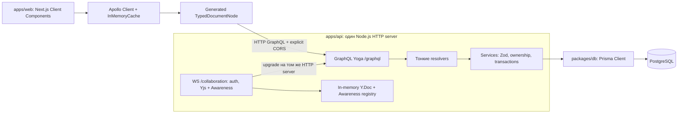

Один HTTP server обслуживает `GET /health`, `/graphql` и WS upgrade на `/collaboration`. HTTP health и GraphQL `health` проверяют процесс и работают без подключения к PostgreSQL. GraphiQL включён только в development. Prisma Client создаётся централизованно в `packages/db`: приложение использует один `prisma`, а `createPrismaClient(url)` позволяет передать отдельное подключение для integration tests.

SDL находится в `apps/api/src/graphql/schema.graphql`. Resolvers вызывают `question.service.ts` и `interview.service.ts`. Zod на границе сервисов проверяет строки, enum values, IDs, pagination и order; максимальный `limit` — 100. Сервисы отвечают за ownership, business validation и transactions. Prisma выполняет database access без дополнительного repository layer.

Доступны queries `health`, `questions`, `question`, `interviews`, `interview`, `codeRuns` и mutations `createQuestion`, `updateQuestion`, `createInterview`, `addQuestionToInterview`, `setActiveQuestion`, `startInterview`, `finishInterview`, `recordCodeRun`. Tokens и notes имеют отдельные service/API contracts только при соответствующих фазах; CodeRun запись ограничена завершёнными результатами браузерного Worker.

## Frontend PHASE 2–7

### Client boundary и fetching

Root layout остаётся Server Component и оборачивает содержимое отдельным `WebApolloProvider`. Provider и компоненты с Apollo hooks используют `use client`. Обычный `ApolloProvider` из Apollo Client 4.3.1 достаточен для выбранного client fetching: у каждого `useQuery` задано `ssr: false`, поэтому во время Next.js server render query не выполняется. Это явная настройка: сама директива `use client` не исключает server render компонента. [Apollo: useQuery SSR option](https://www.apollographql.com/docs/react/api/react/useQuery)

`useState(() => createApolloClient(uri))` создаёт client/cache для экземпляра provider. На сервере этот экземпляр относится к своему render/request, а в браузере сохраняется до unmount provider; module-level singleton отсутствует. Сервер выводит shell/loading state, браузер после hydration загружает данные. API и PostgreSQL не нужны для production build: Codegen читает локальный SDL, а страницы не выполняют GraphQL queries на сервере.

Оценён официальный `@apollo/client-integration-nextjs` 0.14.5: его peer ranges допускают установленные Next.js 16, React 19 и Apollo Client 4. Он предназначен для RSC, server prefetch, streaming SSR и передачи cache в browser hydration. Эти функции потребуются при добавлении server fetching; тогда следует использовать официальный integration package и его request isolation. В PHASE 2 используется обычный provider, поскольку весь GraphQL fetching происходит в браузере. [Apollo: Next.js App Router integration](https://www.apollographql.com/docs/react/integrations/nextjs)

Routes остаются короткими Server Components, а domain UI находится в `src/features/questions` и `src/features/interviews`. `src/shared/api` содержит client/cache/provider/errors/generated documents, `src/shared/ui` — небольшие повторяющиеся элементы. Формы используют React Hook Form и Zod; local selection, submit state и recovery state принадлежат React. Apollo — единственный server-state store.

| Route                      | Назначение                                                                                 |
| -------------------------- | ------------------------------------------------------------------------------------------ |
| `/dashboard`               | Recent interviews, server status filter, Load more, questions count и navigation           |
| `/questions`               | Library, search, language/difficulty filters, loading/error/empty, Load more               |
| `/questions/new`           | Создание задачи через form validation и `CreateQuestion`                                   |
| `/interviews/new`          | Создание интервью после submit и последовательное attachment выбранных задач               |
| `/interviews/[id]`         | Summary, прикреплённые задачи и server status; Start/Finish actions                        |
| `/interviews/[id]/session` | Рабочее пространство IN_PROGRESS: snapshot content, active question и подтверждение Finish |

Summary не содержит Interview Room, редактора, realtime или execution. Status берётся из backend enum. Общий небольшой error helper преобразует Apollo/GraphQL ошибки в сообщения, сохраняя controlled validation/state errors и скрывая database internals.

### Interview session foundation — PHASE 3

Summary остаётся отдельным экраном: сведения, Start и Open session для IN_PROGRESS, после Finish — историческое summary. Session route загружает Interview через network-only query для проверки актуального server status при входе. DRAFT/READY показывает not-started state, FINISHED — finished state со ссылкой на summary; только IN_PROGRESS получает рабочее пространство. Backend mutations независимо проверяют status, ownership и membership.

`InterviewSessionPage` соединяет небольшой `InterviewSessionHeader`, `InterviewQuestionList`, `ActiveInterviewQuestion` и `FinishInterviewDialog`. Desktop navigation — ordered list с difficulty/language и aria-current; mobile — labelled native select. Текущая задача определяется через серверный activeQuestion ID и соответствующий InterviewQuestion; независимого active ID state нет. Контент после старта берётся исключительно из nullable flat snapshot fields attachment, а не из normalized reusable Question.

SetActiveQuestion возвращает полный InterviewFields fragment. Apollo нормализует Interview/attachment, и UI получает подтверждённую active question без полного refetch. Optimistic response не добавлен: для MVP достаточно компактного pending state и блокировки navigation/Finish до ответа; это исключает client-side queue и гонки rollback. Локальное состояние управляет только pending/errors/dialog.

Finish из session требует native dialog confirmation с Cancel/Confirm finish. Пока dialog открыт или mutation выполняется, конфликтующие действия отключены. Success нормализует FINISHED, инвалидирует interview lists и перенаправляет в summary; error оставляет пользователя в session. PHASE 4 заменяет read-only starter code настоящим Monaco Editor; Finish пока не сохраняет локальный draft.

Not-found/network errors и невозможные IN_PROGRESS состояния — нет questions, active ID, membership или полного snapshot — показывают controlled fallback с interview ID, retry/back. Mutable source не подставляется вместо отсутствующего snapshot. Finish остаётся доступным для завершения интервью с broken content. Без realtime внешние изменения обнаруживаются на следующем запросе; backend guards остаются обязательными.

### Monaco Editor и collaborative editing — PHASE 4–5

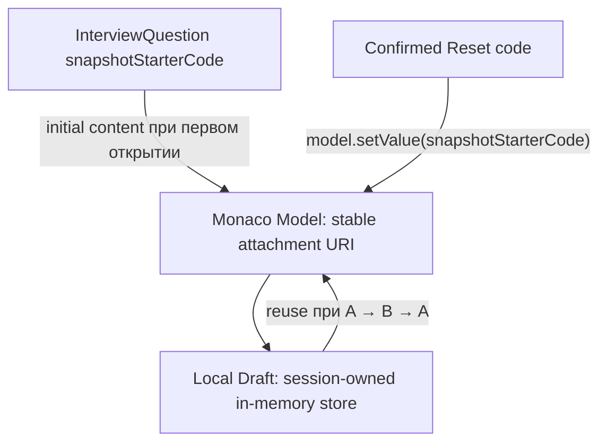

`InterviewSessionPage` владеет `useInterviewDraftStore(interviewId)`: strings и model manager по attachment ID. Apollo хранит business state. `ActiveInterviewQuestion` передаёт snapshot и IDs в `InterviewCodeEditor`; Monaco API сосредоточен в browser-only `MonacoAdapter`. Layout/routes остаются Server Components; `next/dynamic({ ssr: false })` применяется только к adapter.

`@monaco-editor/react` 4.7.0 управляет editor instance, а model manager заранее создаёт модель. `loader.config({ monaco })` получает локальный ESM instance Monaco 0.57.0 без AMD/CDN loader. esbuild 0.28.2 собирает editor и TypeScript module workers в `public/monaco`. Web dev/build вызывают `editor:workers`; generated assets исключены из version control/lint/format и включены в Turbo outputs. [Wrapper configuration](https://github.com/suren-atoyan/monaco-react#loader-config), [Monaco ESM integration](https://github.com/microsoft/monaco-editor/blob/main/docs/integrate-esm.md).

Типобезопасный mapper использует generated ProgrammingLanguage: JAVASCRIPT → javascript/.js, TYPESCRIPT → typescript/.ts, REACT_TSX → typescript/.tsx. URI `codemeet://interview/{interviewId}/question/{interviewQuestionId}/main.{extension}` включает attachment ID. TS/JS defaults задают ESNext, strict и JSX ReactJSX; полноценные React/node_modules types пока не загружаются.

Первое открытие создаёт draft из snapshotStarterCode. Следующий render/Apollo response не перезаписывает draft. `keepCurrentModel` сохраняет модели и undo history при A → B → A. `saveViewState={false}` предотвращает orphan entries в module-global wrapper cache; cursor/scroll restoration пока не добавлен. Model manager освобождает только собственные models.

Dirty сравнивает draft с исходным snapshotStarterCode и отображается текстом Modified/Unmodified. Reset требует native keyboard-accessible confirmation и вызывает setValue только после Confirm reset. Ошибка switch сохраняет прежнюю active question и draft. Chunk/runtime/worker failures показывают controlled editor state; Retry сохраняет draft strings и пересоздаёт owned models, чтобы сбросить cached core-worker fallback. Undo при error recovery может потеряться. Teardown освобождает models, subscriptions и bindings; disposal отложен на одну microtask, чтобы synchronous StrictMode cleanup/setup мог сохранить тот же owner.

Production и настоящий development StrictMode smoke проверили JS/TS/TSX, draft switching/reset, Finish gate, три leave/reopen cycles и viewport до 320px. В normal flow page errors отсутствуют; существующий favicon 404 отмечен отдельно. Deliberate worker abort показывает controlled failure и восстанавливает draft/suggestions после Retry, но vendor Monaco также выдаёт fallback/console/uncaught Event diagnostics. Безопасного scoped public API для их подавления не найдено; global handlers не маскируются. Подробности и screenshots находятся в [PHASE 4 report](phase-4-report.md).

**До PHASE 5 drafts жили только в памяти session workspace.** Сейчас активный Yjs document синхронизируется между клиентами и переживает refresh, пока жив API process. Изменения не сохраняются в PostgreSQL и теряются при рестарте API; snapshots и summary не меняются. Пользовательский код не исполняется.

Интеграция, реализованная в PHASE 5:

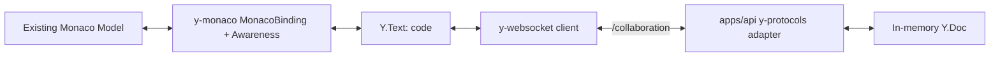

`onEditorReady({ editor, monaco, model })` подключает y-monaco binding к текущей stable model; cleanup вызывается при смене question/editor и unmount. Frontend provider отключает BroadcastChannel, поэтому клиенты обмениваются состоянием через API WebSocket. PHASE 5 добавила Yjs документ; PHASE 6 добавила origin/session/membership авторизацию; PHASE 7 подключила Awareness, описанный ниже. Используются y-websocket client и стандартные y-protocols/lib0 wire protocols; собственный CRDT не создавался. PHASE 9 добавила browser CodeRunner, а PHASE 10 — CodeRun persistence. Durable Y.Doc save mutations ещё не реализованы.

### Ephemeral Awareness и participant presence — PHASE 7

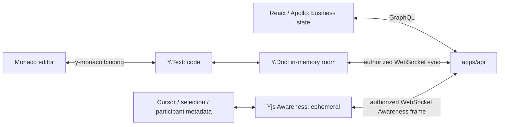

Эти каналы имеют разные источники истины. Apollo/GraphQL хранит business state и управляет статусом интервью и active question. Y.Doc/Y.Text содержит общий код текущего InterviewQuestion. Awareness содержит только `user: { participantId, displayName, role }` и относительную позицию редакторского selection. Awareness не попадает в PostgreSQL, Apollo cache, InterviewEvent или persistent Y.Doc; работа presence не меняет dirty state, которое по-прежнему сравнивает Y.Text с snapshot starter code.

Room identity — пара Interview ID + InterviewQuestion ID. Presence относится только к этой активной Question room: участник на другой задаче не отображается в списке или курсорах. Session показывает компактный список Participants с именем и ролью; вкладки одного participant дедуплицируются по participantId. Если один participant открыл несколько вкладок, каждая авторизованная вкладка может показывать собственный remote cursor, но список содержит человека один раз. Интервьюер и кандидат получают один стабильный цвет из ограниченной палитры через детерминированный hash participantId.

Перед обработкой Awareness update API использует `modifyAwarenessUpdate`: любые присланные клиентом user/id/role и произвольные поля удаляются, после чего добавляется identity из уже авторизованного соединения. Один WebSocket может владеть одним Awareness client ID; сервер отвергает попытку перехватить ID другой вкладки. Для cursor принимаются только корректные Yjs relative positions к `Y.Text("code")`; name передаётся в Monaco как injected text, без HTML. y-monaco 0.1.6 сам конвертирует Monaco selection в relative positions и рисует selection; дополнительная Monaco decoration показывает colored caret и безопасную текстовую подпись.

Provider отключает BroadcastChannel (`disableBc: true`), чтобы presence, курсоры и документ шли через авторизованный WebSocket. При разрыве стандартные Awareness removal/timeout протокола убирают участника; y-websocket переподключается и снова отправляет локальный state. При question switch старая binding/provider уничтожаются, а новая активная room публикует identity заново. Отложенный room release сохраняет StrictMode mount/unmount/mount поведение без второго provider или ghost local participant.

`setActiveQuestion` остаётся GraphQL mutation. Presence не является business event channel: автоматическое переключение candidate при смене activeQuestion другим клиентом не реализовано, candidate должен обновить Session. Already-open connections не получают мгновенный finish/revoke event от другого процесса; эти ограничения, TEMP DEMO AUTH и in-memory Y.Doc описаны в [PHASE 7 report](phase-7-report.md).

Форма задачи проверяет title 1–200 после trim, description 1–20 000 и starter code до 100 000 символов; starter code сохраняет whitespace и допускает пустое значение. После `CreateQuestion` выполняется переход в `/questions?created=1`. Interview form требует title и хотя бы одну selected question. Labels связаны с inputs, field errors используют `aria-invalid`/`aria-describedby`; mutation buttons отключаются и показывают progress text. Начальная загрузка списков использует компактное loading state, а Load more сохраняет уже показанные записи.

### SDL → operations → TypedDocumentNode

Единственный source of truth — `apps/api/src/graphql/schema.graphql`. `apps/web/codegen.ts` читает этот файл напрямую, поэтому frontend не поддерживает вторую schema и generation не требует работающего API. Domain operations находятся в `src/features/questions/api/questions.graphql` и `src/features/interviews/api/interviews.graphql`. Generated output — `src/shared/api/generated/graphql.ts`; отдельный `packages/graphql` пока не создаётся, поскольку второго потребителя этих client operations нет.

Используются CLI 7.4.3, `typescript-operations` 6.1.9 и `typed-document-node` 7.1.1. Operations v6 генерирует необходимые operation/input types и enum union types, а TypedDocumentNode plugin — готовые AST с типами result и variables. Apollo hooks выводят типы из документа. Generated React hooks не нужны; прямые plugins выбраны по рекомендации Apollo 4, где client preset описан как дополнительный runtime и источник несовместимого fragment masking. [Apollo: GraphQL Codegen](https://www.apollographql.com/docs/react/development-testing/graphql-codegen), [Apollo: TypedDocumentNode inference](https://www.apollographql.com/docs/react/data/typescript)

Конкретный путь: SDL `QuestionPage` → operation `GetQuestions` → generated `GetQuestionsDocument` → `useQuery` → `data.questions.items` в Questions UI. Frontend не описывает вручную `QuestionQueryResult` или operation variables:

```tsx
const { data } = useQuery(GetQuestionsDocument, {
  variables: { limit: 12, offset: 0 },
  ssr: false,
});
```

Generated artifacts хранятся в repository и предназначены для commit вместе с operations; на текущем этапе commit не выполняется. Они остаются в исходном формате Codegen, исключены из Prettier и ESLint и проверяются TypeScript. Команды `graphql:codegen`, `graphql:codegen:watch`, `graphql:codegen:check` используют штатный CLI. `--check` сравнивает файлы с результатом generation, возвращает ошибку для stale output; несовместимая со SDL operation также останавливает проверку. Build и typecheck запускают эту проверку. Ручное форматирование generated файла сделало бы его постоянно stale. [Codegen: dry-run mode](https://the-guild.dev/graphql/codegen/docs/config-reference/codegen-config#dry-run-mode)

### Normalization, pagination и mutations

`User`, `Question` и `Interview` нормализуются стандартным Apollo ID из `__typename` и `id`. Дополнительные `keyFields: ['id']` не требуются. Все query/mutation fragments возвращают идентификаторы и полные используемые UI поля; mutation results обновляют уже существующие normalized records. [Apollo: cache IDs](https://www.apollographql.com/docs/react/caching/cache-configuration)

List cache отделяет filter sets и page size: `questions` имеет `keyArgs` `search/language/difficulty/limit`, `interviews` — `status/limit`; `offset` объединяет страницы одного набора. `limit` сохраняется в key, чтобы dashboard count с размером 1, recent interviews с размером 6 и library с размером 12 не смешивали arrays и pageInfo.

`fetchMore` получает следующую страницу. Merge сохраняет элементы в raw offset positions и добавляет страницу в соответствующие slots; read удаляет пустые slots и дубликаты по entity ID только из возвращаемого UI списка. Pagination продолжает использовать server offset, а не длину очищенного списка. Ответ с `offset: 0` заменяет ранее загруженные страницы. Поздний ответ предыдущей страницы не откатывает сохранённую позицию самой дальней страницы и её `hasNextPage`. Offset pagination всё ещё зависит от изменений server ordering; cursor pagination остаётся будущей оптимизацией.

| Mutation                 | Выбранная стратегия cache                                                                                                   |
| ------------------------ | --------------------------------------------------------------------------------------------------------------------------- |
| `CreateQuestion`         | Normalize result; evict `ROOT_QUERY.questions` для всех filter/page-size variants                                           |
| `UpdateQuestion`         | Operation подготовлена; будущий edit UI должен normalize entity и evict lists, поскольку filter membership может измениться |
| `CreateInterview`        | Normalize result; evict `ROOT_QUERY.interviews` для появления нового интервью                                               |
| `AddQuestionToInterview` | Normalize полный Interview с questions/READY; evict interview lists, поскольку attachment меняет status membership          |
| `StartInterview`         | Normalize status/timestamps; evict interview lists с возможным изменением status membership                                 |
| `FinishInterview`        | Normalize status/timestamps; такая же invalidation interview lists                                                          |
| `SetActiveQuestion`      | Normalize Interview.activeQuestion и attachment snapshot fields; без list eviction и refetch                                |

Eviction затрагивает только соответствующее root list field, сохраняя normalized entities и detail query. Следующее чтение загружает первую страницу. Dashboard имеет server status filter, поэтому status-changing mutations не могут полагаться только на normalization: membership и total count списка требуется загрузить заново. После Start/Finish обновляется только видимый dashboard list query с `offset: 0`; общего `refetchQueries: ['всё']` нет. На summary существующий Interview обновляется автоматически из mutation response.

### Частичный успех создания интервью

Submit сначала вызывает `CreateInterview`, затем последовательно `AddQuestionToInterview` для выбранных задач. Каждая mutation имеет свою backend transaction; frontend не может сделать всю последовательность атомарной. Созданный interview ID и зафиксированный form selection сохраняются в состоянии формы. При attachment failure UI показывает частичный результат и сохраняет возможность открыть summary или повторить оставшиеся attachment без создания ещё одного интервью.

Если ответ attachment потерян и commit неясен, `GetInterview` с `network-only` сверяет уже прикреплённые question IDs перед retry. При первой attachment ошибке также выполняется best-effort reconciliation; повторный retry обязательно перечитывает Interview перед записью. Повторно отправляются только отсутствующие задачи. Во время recovery форма не меняет исходный title/selection. Client state не заменяет persisted server state или idempotency key: после потери самой страницы дальнейшее восстановление выполняется через существующее интервью. При потере ответа самого `CreateInterview` ID может остаться неизвестным клиенту: UI отключает повторный submit и направляет к overview, чтобы пользователь проверил созданные интервью. Полноценная idempotent creation остаётся будущим улучшением.

### Environment и CORS

Web scripts запускают Next.js через `scripts/next.mjs`: `loadEnvFile` загружает root `.env` перед импортом Next CLI; shell env имеет приоритет. Такой launcher не передаёт env-file CLI flags в Next workers. Browser endpoint берётся только из `NEXT_PUBLIC_GRAPHQL_URL`. Это публичное значение Next.js встраивает при build: смена production URL требует rebuild, а секреты в нём не допускаются. HttpLink использует `credentials: 'omit'`. Отсутствующий/невалидный endpoint показывает понятное configuration state.

API читает `CORS_ALLOWED_ORIGINS` как список explicit HTTP(S) origins. Пример local setup разрешает `http://localhost:3000` и `http://127.0.0.1:3000`. Yoga builder сопоставляет Origin точно и выдаёт его только при membership; credentials выключены, разрешены GET/POST и Content-Type. Wildcard и URL с credentials/path/query/hash отвергаются. Пустая конфигурация не выдаёт browser CORS access. `Vary: Origin` добавлен для allowed, denied и preflight responses. Запросы без Origin продолжают работать для CLI и tests. [Yoga: CORS](https://the-guild.dev/graphql/yoga-server/docs/features/cors)

CORS ограничивает доступ браузера к ответу; он не заменяет auth или server Origin/CSRF policy. Denied Origin не получает allow headers, но сам HTTP request может вернуть 200. Настоящие cookies, credentials и CSRF рассматриваются вместе с будущей auth.

### Frontend tests

Jest 30, React Testing Library и MSW 3 проверяют поведение UI через настоящий Apollo Client и HttpLink. MSW сопоставляет GraphQL operation names и возвращает network responses; Apollo hooks и cache internals не мокируются. Покрываются loading/list/empty/error, search/filter/Load more, form validation/submit, GraphQL errors, выбор обязательной задачи, успешный и частичный create flow, Start/Finish и invalid transition. Каждый render получает собственный client/cache; handlers и DOM сбрасываются между tests. PHASE 3 добавила session/snapshot/confirmation cases; PHASE 4 — editor drafts/reset/recovery и model lifecycle/StrictMode cases с browser adapter stub. Подтверждены 74 frontend и 83 backend tests: 157 tests в 12 suites. Итоговые проверки приведены в [PHASE 4 report](phase-4-report.md).

## Backend domain и transactions

PHASE 2 добавила только CORS transport configuration. PHASE 3 расширяет InterviewQuestion nullable snapshot fields, SDL и start transaction, а также ограничивает attachments подготовкой и active-question switching статусом IN_PROGRESS. Существующие Serializable strategy, owner scope, composite FK и test database infrastructure сохранены.

### Domain model и database invariants

| Модель                 | Назначение и важные связи                                                              |
| ---------------------- | -------------------------------------------------------------------------------------- |
| `User`                 | Имя и unique email; автор вопросов и интервью, registered participant, автор заметок   |
| `Interview`            | Status, timestamps, creator и active question из прикреплённых задач                   |
| `InterviewParticipant` | Роль в интервью; interviewer имеет User, candidate присоединяется как guest            |
| `Question`             | Reusable задача: условие, difficulty, language, starter code, creator                  |
| `InterviewQuestion`    | Membership/order и frozen snapshot после Start; duplicate question/order запрещены     |
| `GuestToken`           | Unique token hash, expiration и used timestamp; raw token не хранится                  |
| `ParticipantSession`   | Candidate bearer hash, expiration и revocation timestamp                               |
| `CodeRun`              | Неизменяемый источник и client-reported результат; задача и actor принадлежат интервью |
| `InterviewNote`        | Текст, интервью и User author; permission автора-interviewer добавится с note service  |
| `InterviewEvent`       | Event enum и JSONB payload, структура которого зависит от типа события                 |

Composite foreign keys объявлены в Prisma schema и автоматически попали в migration. `(Interview.id, activeQuestionId)` ссылается на `(InterviewQuestion.interviewId, questionId)`; такая же membership связь задана для задачи `CodeRun`. `(CodeRun.interviewId, createdByParticipantId)` ссылается на `(InterviewParticipant.interviewId, id)`. Nullable actor допускается. Отдельные relations к `Question` сохраняют удобные выборки reusable задач.

В migration SQL добавлены три правила: CHECK `InterviewQuestion.order >= 0`, CHECK обязательного `userId` для `INTERVIEWER` и partial unique index, допускающий одного `CANDIDATE` на интервью. Их нужно сохранять при review будущих migrations. Unique `(interviewId, userId)` запрещает повторный registered membership, сохраняя nullable guest identity.

| Индексы                                                                                     | Назначение                                     |
| ------------------------------------------------------------------------------------------- | ---------------------------------------------- |
| `User.email`, `GuestToken.tokenHash`, `ParticipantSession.tokenHash` unique                 | Поиск пользователя и bearer hashes             |
| `Interview.status`, `Interview.createdById`, `Question.createdById`                         | Status filter и owner scope                    |
| `InterviewQuestion(interviewId, questionId)` unique                                         | Membership и защита от duplicate attachment    |
| `InterviewQuestion(interviewId, order)` unique                                              | Уникальный order и упорядоченная выборка задач |
| `InterviewParticipant(interviewId, userId)` и `(interviewId, id)` unique                    | Membership и composite FK для actor            |
| `InterviewEvent(interviewId, createdAt)`, `CodeRun(interviewId, questionId, createdAt, id)` | Timeline и question-scoped run history         |

Составные индексы связей начинаются с `interviewId` и покрывают поиск по этому левому префиксу. Отдельные индексы только на `InterviewQuestion.interviewId` и `InterviewParticipant.interviewId` повторяли бы существующий доступ. Текстовые фильтры сейчас используют `contains`; full-text или trigram index выбирается по реальным объёмам и запросам.

Исторические relations используют `Restrict`: удаление автора, reusable задачи или интервью не оставляет events, notes, runs и participants без связей. Только owned edge `InterviewQuestion → Interview` имеет `Cascade`; удаление reusable `Question` ограничено. Composite FK запрещают удаление attachment, используемого как active question или в CodeRun. Hard delete mutations отсутствуют; archive/retention policy определяется позже.

Seed выполняется в одной transaction. Stable IDs и `upsert` с `update: {}` создают demo user, три задачи и DRAFT interview с двумя задачами, interviewer и created event. Повторный seed сохраняет изменённые задачи и состояние завершённого интервью.

### Reusable Question и immutable InterviewQuestion snapshot

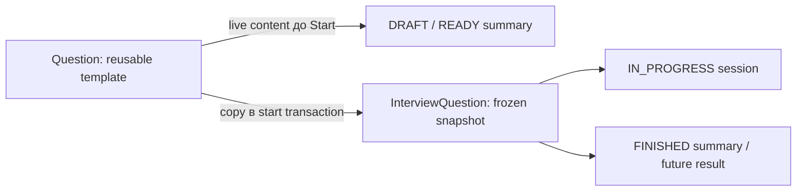

InterviewQuestion имеет nullable `snapshotTitle`, `snapshotDescription`, `snapshotDifficulty`, `snapshotLanguage`, `snapshotStarterCode`, `snapshotCapturedAt`. Flat GraphQL fields соответствуют модели; отдельный snapshot type не нужен. SQL CHECK требует либо шесть null, либо шесть non-null; пустой starter code допустим. Один capturedAt совпадает со startedAt для всех attachments.

Snapshot создаётся при **Start**, а не Add: interviewer может исправить reusable Question до начала и получить актуальные данные. После старта изменения library не влияют на session/history. Start в одной Serializable transaction загружает ordered attachments/current Questions, записывает все snapshots, выбирает первую active question, меняет status/timestamp и создаёт INTERVIEW_STARTED. Ошибка любой записи откатывает всё; повторный Start не перезаписывает snapshots.

Migration additive и не синтезирует историю ранее начатых интервью из текущих шаблонов: такие snapshots остаются null и видны как controlled missing-snapshot state. Никакого автоматического current-Question fallback после старта нет. Immutability обеспечивается отсутствием API изменения snapshot и lifecycle guards: Add только DRAFT/READY; remove/reorder API отсутствуют. Административный прямой SQL не является поддерживаемым application write path.

### State machine и transactions

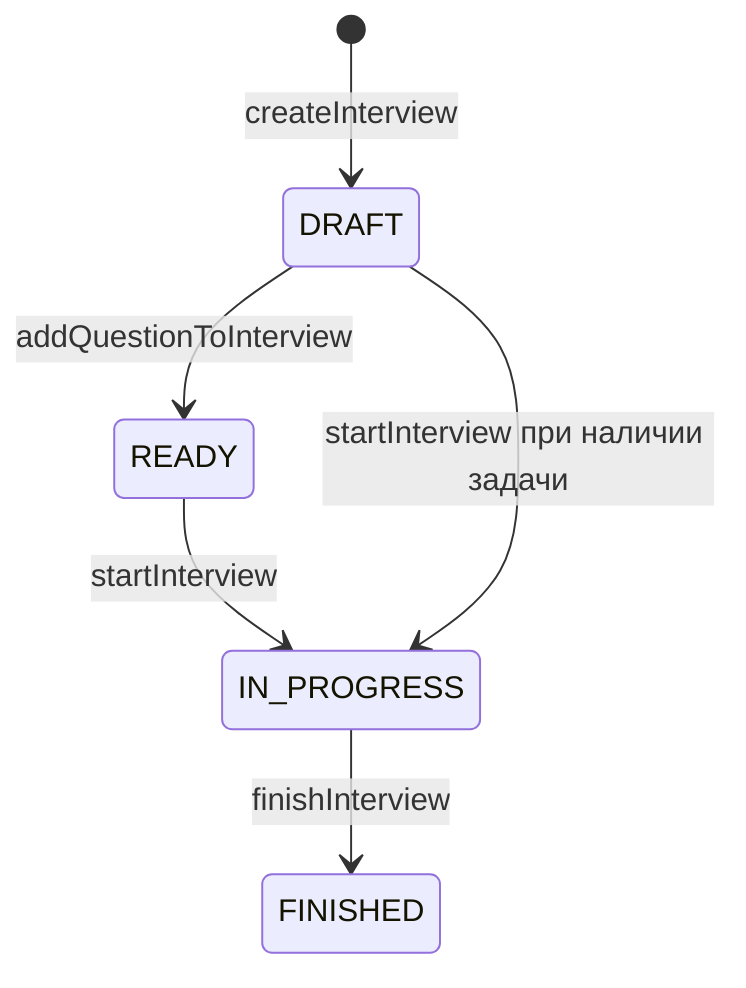

`READY` достижим: первое attachment в DRAFT меняет status. Seed по требованиям создаёт DRAFT уже с задачами, поэтому start разрешён из DRAFT и READY. Он требует хотя бы одну задачу, фиксирует snapshots/startedAt и всегда выбирает первую по order active question, включая legacy pre-start selection. Add разрешён только в DRAFT/READY; SetActiveQuestion — только IN_PROGRESS. Finish разрешён только из IN_PROGRESS и выставляет finishedAt. FINISHED закрыт для дальнейших изменений. Повторная установка уже активной задачи — no-op без нового event.

Создание интервью вместе с creator participant и `INTERVIEW_CREATED`, attachment вместе с READY, смена active question вместе с `QUESTION_CHANGED`, start и finish вместе с соответствующими events выполняются в Serializable transactions. При `P2034` повторяется вся transaction, максимум три попытки. Отказ event insertion откатывает бизнес-изменение. Conditional updates включают owner и допустимый status и требуют ровно одну изменённую строку; unique constraints защищают parallel attachment от duplicate question и order.

QUESTION_CHANGED payload сохраняет `{ questionId, previousQuestionId }`; snapshot в event не дублируется. Membership проверяется перед записью и защищён composite FK. Active ID update и event atomic; failed event insertion оставляет прежнюю active question. Статус и attached question order не вычисляются frontend.

Страничные queries получают items и total count в RepeatableRead transaction, чтобы значения соответствовали одному snapshot. Обновление задачи включает owner scope непосредственно в update. `Interview.version`, `expectedVersion` и idempotency keys запланированы для realtime и client conflict handling.

### TEMP DEMO AUTH, guest identity и authorization

Context содержит lazy `getIdentity()`: без Authorization header используется TEMP DEMO AUTH интервьюера, с bearer header валидируется отдельная Candidate ParticipantSession по SHA-256 hash, `expiresAt` и `revokedAt`. `DEMO_AUTH_ENABLED=true` остаётся только локальным общим interviewer principal; API запрещает этот режим при `NODE_ENV=production`. Candidate не может вызвать owner queries/mutations. `interview(id)` доступен только для interview его participant; creator/User relations, participant list и nested reusable Question данные скрыты или заменены immutable attachment snapshot. `InterviewNote` поля отсутствуют в SDL. UI ограничения дополняют, но не заменяют server guards.

Invite и participant session token генерируются из 32 random bytes (256 bits) и хранятся в БД только как SHA-256 hashes с unique indexes. Invite действует 48 часов и одноразовый; `joinInterview` в одной Serializable transaction проверяет invite/state, conditionally помечает `usedAt`, создаёт Candidate participant, ParticipantSession и один `CANDIDATE_JOINED` event. При serialization conflict повторяется вся transaction; параллельный join не оставляет частичный participant/event. Сырые токены возвращаются один раз. Candidate token хранится в tab-scoped `sessionStorage`, чтобы пережить refresh текущей вкладки; localStorage не нужен. Apollo передаёт его в `Authorization: Bearer` header. SHA-256 digest находится через unique index; отдельный constant-time string comparison не используется, поскольку application не сравнивает секрет с хранимым значением и token имеет 256 bits entropy.

Authentication/identity (`кто запросил`) отделена от authorization (`имеет ли он право на этот interview/action`). Candidate identity строится только из действующей ParticipantSession и связанного Candidate participant. Display name или participant ID сами по себе не дают доступ. Interviewer identity остаётся общим Demo principal и не является production login.

Controlled errors имеют категории `BAD_USER_INPUT`, `NOT_FOUND`, `CONFLICT`, `INVALID_STATE`, `UNAUTHENTICATED` и `INTERNAL_SERVER_ERROR`. Неожиданные ошибки маскируются; database messages и stack не выходят клиенту. Подробный logging допускается в development.

Сервисы заранее загружают `Question.createdBy`, `Interview.questions.question.createdBy`, `Interview.participants.user`, creator и active question через Prisma `include`. Вложенные resolvers возвращают уже полученные relations без query для каждого элемента. Это устраняет N+1 на текущих GraphQL полях; дополнительные запросы для include relations выполняет Prisma. DataLoader добавляется при измеренной необходимости, например при независимых field-level загрузках. Eager include сейчас может выбирать данные вне GraphQL selection; оптимизация по selection set отложена.

### Integration test strategy

Jest проверяет HTTP/GraphQL, services и настоящий PostgreSQL без моков Prisma. Обязательный `TEST_DATABASE_URL` указывает на отдельную БД с именем, заканчивающимся `_test`. Каждый запуск создаёт schema `cm_test_<uuid>`, применяет committed migrations и seed, передаёт scoped Prisma client в API и удаляет только свою generated schema. `createPrismaClient` передаёт schema из URL в `PrismaPg`, поэтому adapter и migration CLI используют одну область данных.

47 integration tests PHASE 1 проверяют operations, validation, ownership, transitions, constraints, parallel mutations, seed preservation и rollback при отказе записи event. PHASE 2 добавляет отдельные CORS tests: explicit origin, preflight, denied origin, отсутствие wildcard/credentials и validation configuration. Health и CORS checks работают без доступной БД. Development database не сбрасывается; auth, realtime и browser execution tests добавятся вместе с соответствующими функциями.

PHASE 3 добавляет integration cases для snapshot-at-start, актуальной версии до Start, неизменности после UpdateQuestion, first-active/order, state guards, event no-op/rollback и atomic snapshots/status/event. Старые pre-start switching fixtures переведены в разрешённый IN_PROGRESS без удаления regression checks. Frontend RTL/MSW cases покрывают session states, switching/normalization, confirmation/error/redirect, frozen history и mobile navigation.

## Два приложения вместо трёх

`apps/web` содержит Next.js App Router, dashboard, question library, формы, interview summary, `/join/[token]` и session с collaborative Monaco Editor. `apps/api` — один Node.js HTTP server с GraphQL Yoga, Yjs WebSocket adapter и отдельным Session Events endpoint. Модули имеют отдельные обязанности, но общий процесс и доступ к одному экземпляру комнат и event subscribers.

Для MVP это позволяет выполнить бизнес-операцию, сохранить событие в SQL и уведомить подключённых участников без межпроцессного брокера. Отдельное `apps/realtime` потребовало бы дополнительного канала API → realtime и согласования финальных snapshots. Выделение процесса откладывается до реальной потребности масштабировать комнаты отдельно.

Диаграмма показывает текущие realtime boundaries и отдельный browser execution boundary:

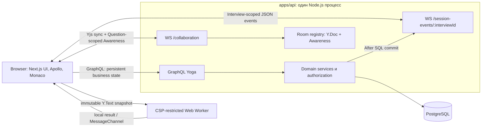

Для production предполагается один публичный origin: reverse proxy направляет страницы и Auth.js в web, GraphQL и WebSocket — в API. Поддержка WebSocket upgrade на proxy проверяется в инфраструктурной фазе. Локальная разработка может использовать разные порты на `localhost` с явными разрешёнными origins.

## Владение кодом и пакетами

| Область            | Ответственность                                                                       | Текущее состояние                             |
| ------------------ | ------------------------------------------------------------------------------------- | --------------------------------------------- |
| `apps/web`         | Next.js routes, domain operations/forms, Apollo client/cache и generated documents    | PHASE 4: Monaco Editor и локальные drafts     |
| `apps/api`         | HTTP health, Yoga, SDL, resolvers, context и бизнес-сервисы; будущие realtime комнаты | PHASE 3: snapshot/lifecycle transactions      |
| `packages/config`  | Общие TypeScript и ESLint настройки                                                   | Используется с PHASE 0                        |
| `packages/db`      | Prisma schema, migrations, seed, серверный client                                     | PHASE 3: additive snapshot migration          |
| `packages/graphql` | Возможный общий GraphQL contract при наличии нескольких consumers                     | Не создан; SDL в API, client operations в web |
| `packages/shared`  | Только реально общие контракты без привязки к browser или Node.js                     | Добавляется при появлении потребности         |

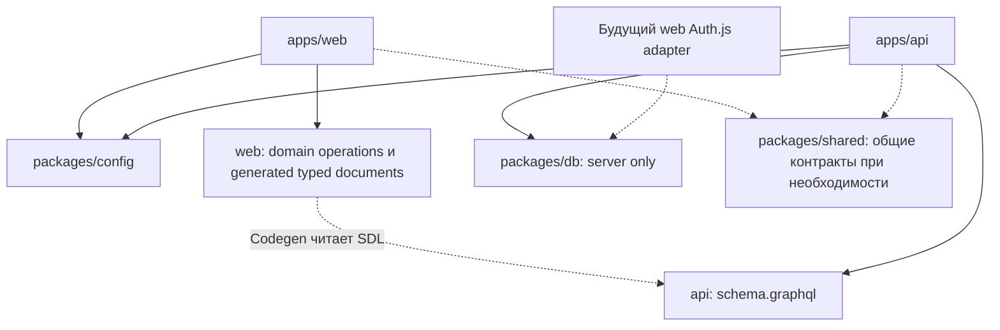

`packages/db` не импортируется в browser bundle. Будущее исключение из правила «данные меняет API» — серверный Auth.js adapter: он будет работать с auth accounts/sessions, а не с интервью. Prisma models типизируют database records на сервере. Frontend response types уже выводятся GraphQL Codegen из SDL и operations; отдельные business event contracts не заменяют Codegen. Operations пока принадлежат только web, поэтому общий package не нужен.

Сначала код организуется рядом с функцией. Каталоги `features`, `entities`, `widgets` и domain services добавляются, когда в них есть содержимое. Не создаются универсальные repository interfaces, event bus package, shared UI package или пустые слои ради структуры.

## Authentication и authorization — PHASE 6 и будущие фазы

Candidate invite/session flow реализован в PHASE 6. Настоящий interviewer sign-in и production-grade session strategy остаются будущей работой.

Auth.js работает в серверной части web. Рекомендуемый вариант для интервьюера — OAuth и database session с opaque идентификатором в HttpOnly cookie: сервер проверяет существование и срок session, а отзыв session действует без отдельного JWT blocklist. Auth.js поддерживает database и JWT стратегии; выбор конкретного provider и совместимость со стратегией уточняются при реализации auth. Демо seed пользователя сам по себе не является механизмом входа. [Auth.js: session strategies](https://authjs.dev/concepts/session-strategies), [Prisma adapter](https://authjs.dev/getting-started/adapters/prisma)

API самостоятельно определяет principal по подтверждённым сервером credentials. Для выбранной database strategy это проверка auth session в PostgreSQL; параметры cookie должны быть согласованы между web и API. Нельзя принимать переданный browser `userId`/`role` как доказательство личности или считать проверку страницы достаточной защитой API.

Interviewer создаёт invite с maximum lifetime 48 часов для READY/IN_PROGRESS interview. Candidate открывает `/join/<raw-invite-token>`, вводит display name и вызывает `joinInterview`. API возвращает raw participant session token ровно один раз; browser хранит его в `sessionStorage` этого tab, а не в HttpOnly cookie: web/API могут быть на разных origins/ports без общей cookie strategy. Session живёт 7 дней и может быть revoked в БД. Refresh той же вкладки восстанавливает identity; новая вкладка без session token проходит invite flow заново.

У роли есть контекст интервью: наличие аккаунта интервьюера не даёт доступ к чужим интервью. Каждая бизнес-операция проверяет membership, роль и status. Candidate получает только разрешённую задачу и доступные ему результаты; private notes исключаются серверной authorization, в том числе из вложенных GraphQL полей и business events.

При WebSocket upgrade проверяются allowlisted `Origin` и room path. До `Y.Doc` lookup/sync клиент отправляет первым application message participant token; y-websocket `open` callback удерживается browser adapter до auth acknowledgement, поэтому начальный Yjs sync не уходит раньше. Candidate session проверяет role, participant/interview relationship, expiry/revocation и совпадение Interview ID; interviewer по TEMP Demo Auth проверяется на interviewer membership. Затем перепроверяются `IN_PROGRESS` и принадлежность InterviewQuestion. Знание interview/question/room ID не даёт Candidate доступ к другой комнате.

Token не передаётся query параметром и не входит в WebSocket URL. Invite token остаётся частью `/join/<token>` URL по заданному user flow; route задаёт Referrer-Policy `no-referrer`, API application logs не печатают GraphQL variables или token frames. Production proxy access logs тоже должны редактировать invite path. Expiry проверяется при новом connection, активный socket закрывается по истечению participant session. Отзыв session или Finish из другого процесса не вызывает немедленный WS business event в PHASE 6; это ограничение останется до отдельного realtime events этапа.

Cookie-based HTTP mutations требуют проверки разрешённого Origin и защиты от CSRF. Production cookies используют HttpOnly, Secure и согласованный SameSite. Invite/session credentials не попадают в application logs; secrets хранятся вне repository.

## Guest join и participant identity — PHASE 6

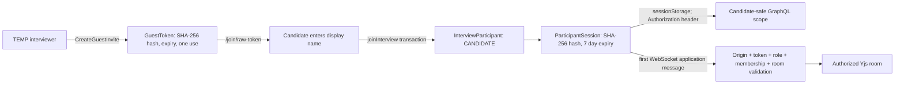

GraphQL использует bearer token только для определения candidate identity; каждый запрос отдельно проверяет доступ к связанному interview и запрещённым owner operations. Перед Yjs sync WebSocket сверяет session, role, participant interview и attachment membership. Identity отвечает на вопрос «кто подключился», а authorization — на вопрос «какие данные и действия ему разрешены».

Interviewer пока всё ещё общий TEMP DEMO AUTH principal без пользователя-владельца credentials. Его действия защищены owner/membership checks относительно demo user, но это не реальная authentication и не multi-user production boundary. Candidate session проверяется из БД по hash, expiry и revokedAt. `sessionStorage` переживает refresh того же tab; закрытие tab удаляет bearer на клиенте, а HTTP-only cookie/CSRF flow остаётся будущим решением вместе с interviewer login.

Candidate получает только собственный interview, immutable snapshots, свои participant fields и active question metadata. Creator email, interviewer user relation и reusable Question текущие mutable поля не выдаются. Private notes пока отсутствуют в GraphQL SDL. Candidate не может вызывать mutations interviewer, переключать active question или завершать interview.

PHASE 6 защищает participant identity и membership для candidate. PHASE 8 добавляет realtime delivery для смены active question и Finish. Отзыв session закрывает новые подключения и истекающий socket, но отдельного мгновенного revoke event для уже открытого socket пока нет.

## Session Events — PHASE 8

GraphQL/PostgreSQL остаётся источником persistent business state. Y.Doc/Y.Text отвечает за collaborative text, Awareness — за эфемерные presence, cursor и selection в Question room, а Session Events уведомляют участников, что Interview state изменился. Session Events не содержат отдельную копию active question/status и не являются source of truth.

API использует два отдельных WebSocket endpoint на том же HTTP server:

- `/collaboration` сохраняет binary y-websocket protocol для Yjs sync и Awareness. Его комнаты scoped к `interview:{interviewId}:question:{questionId}`.
- `/session-events/:interviewId` использует отдельный JSON protocol и Interview-scoped subscribers. Один участник может сменить Question room, оставаясь в том же Interview event channel.

Client отправляет первое JSON сообщение для authentication. Candidate передаёт participant-session token в application message, не в URL; сервер проверяет его hash, срок, отзыв, participant role и совпадение Interview. Interviewer identity берётся из существующего API context и допускается только при наличии interviewer membership в этом Interview. Origin проверяется по тому же allowlist, что и collaboration socket. После проверки сервер отвечает `{"type":"authenticated"}`.

Текущий discriminated event protocol содержит:

- `ACTIVE_QUESTION_CHANGED { interviewId, occurredAt }`;
- `INTERVIEW_FINISHED { interviewId, occurredAt }`.

Оба payload намеренно работают как invalidation: сервер не доверяет event как business state, а frontend после authentication, reconnect или валидного event перечитывает canonical Interview через Apollo/GraphQL. Повторные события безопасны: одинаковый ответ не меняет active question, не создаёт второй collaboration provider и не запускает новый room lifecycle. Refetch запросы коалесцируются и выполняются последовательно, чтобы близкие уведомления не создавали шторм запросов. Инициатор тоже получает echo; его GraphQL mutation result и refetch приводят к одному и тому же normalized Interview.

Порядок active-question flow: `setActiveQuestion` валидирует owner, status и membership, затем в Serializable transaction обновляет active question и сохраняет audit `InterviewEvent`. Только после успешного завершения transaction resolver публикует `ACTIVE_QUESTION_CHANGED`. Candidate получает уведомление и перечитывает Interview; существующая Session логика переключает Question, очищает старую Awareness/Yjs lifecycle и открывает новую Question room. `finishInterview` атомарно обновляет status и сохраняет audit event, после commit публикует `INTERVIEW_FINISHED`. Candidate получает canonical `FINISHED`, редактор становится read-only и collaboration lifecycle уничтожается.

Events ephemeral: уведомление может потеряться между SQL commit и broadcast либо пока клиент offline. При каждой успешной socket authentication frontend перечитывает Interview, поэтому reconnect восстанавливает фактические active question/status без replay API, polling loop или durable event queue. Это также делает event ordering вторичным: при быстром переходе A → B → C canonical query определяет текущее состояние.

`InterviewEvent` остаётся persistent audit/history записью в транзакции и не используется как transport queue. В этой фазе нет replay, outbox или cross-process pub/sub; fanout хранится в памяти одного API process. Для нескольких API replicas потребуется общий event routing/outbox и координация Yjs rooms. Мгновенный revoke event для уже открытого socket также остаётся будущей работой.

## Server persistence, snapshots и гонки — план следующих фаз

PHASE 3 сохраняет immutable condition/starter-code snapshots в InterviewQuestion при Start. PHASE 4 добавила Monaco models, PHASE 5 подключила к ним per-question Yjs documents. Состояние Yjs сейчас только in-memory на API и теряется после его restart; `CodeDocument`, starter-file records, durable Yjs state, room locks и business version пока отсутствуют. Следующие требования относятся к будущей server persistence и завершению business lifecycle.

Будущий `CodeDocument` принадлежит заданию конкретного интервью (`InterviewQuestion`), а не reusable `Question`. Он инициализируется из уже сохранённого starter-code snapshot; library update не меняет историю. При появлении нескольких starter files они моделируются явно; JSON используется для ограниченного event payload, а не вместо отношений и файловых records.

Сервер загружает сохранённый Yjs state и добавляет starter code один раз. Binary Yjs state хранится вместе с читаемыми snapshots. Периодическая запись использует debounce с максимальной задержкой; параллельные flush сериализуются, чтобы поздняя запись старого snapshot не затёрла новую. На смене задачи и finish выполняется обязательный flush. Yjs позволяет обмениваться binary updates и state vectors, поэтому повторная доставка не требует ручного разрешения текстовых конфликтов. [Yjs document updates](https://docs.yjs.dev/api/document-updates)

Debounce сохраняет refresh/reconnect сценарии при живом сервере, но имеет ограниченное окно потери данных при аварийном завершении процесса. Перед выпуском выбираются и документируются max delay и момент подтверждения сохранения; нулевая потеря при crash требует записи updates до соответствующего acknowledgement. Полный replay каждого символа не является условием MVP.

Для будущих business transitions добавляются `Interview.version` и conditional SQL update по `expectedVersion` и допустимому status. При конфликте сервер возвращает актуальное состояние и понятную ошибку; CRDT не выбирает победителя. Unique constraints и idempotency key будут защищать join/run/finish от повторных запросов. Сейчас PHASE 1 использует Serializable transactions и conditional status updates, описанные выше.

Последовательность завершения интервью:

1. Сервис получает блокировку операции комнаты и прекращает принимать новые document updates.
2. Уже принятые updates применяются; сервер получает authoritative final snapshots всех документов.
3. SQL transaction сохраняет snapshots, меняет status/version и записывает `INTERVIEW_FINISHED`.
4. После commit отправляется event; WS остаётся только для чтения либо закрывается. Если transaction не состоялась, блокировка снимается и интервью продолжает работать.

Смена active question аналогично фиксирует предыдущий snapshot до смены бизнес-состояния и блокирует запись в неактивный документ. Run получает immutable snapshot конкретного document generation и state vector; запуск разрешён после подтверждения, что нужные локальные edits синхронизированы. Недоставленные offline изменения не могут считаться финальным серверным snapshot и не принимаются после finish.

Reset создаёт новую generation документа и отзывает запись в старую. Простое удаление текста в старом Y.Doc позволило бы offline клиенту после reconnect вернуть устаревшие edits. UI сохраняет локальный document при коротком disconnect, различает connecting/reconnecting/synced и не считает открытый сокет подтверждением полной синхронизации.

Presence и cursor/selection остаются ephemeral. Heartbeat/disconnect detection снимают отсутствующих участников, а UI показывает reconnect отдельно от offline. SQL не получает записи на каждое движение курсора или символ.

## Browser code execution and run history — PHASE 9–10

Execution flow is deliberately local to `apps/web`:

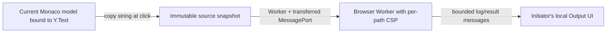

At Run, the frontend reads `model.getValue()` synchronously from the active question model. That Monaco model is bound directly to its collaborative `Y.Text`, so remote Yjs edits are already reflected; starter snapshot, React render state and Apollo are not read. Strings are immutable snapshots, and the running Worker receives no reference to later model changes. Worker request, running state and output never enter Y.Doc, Awareness, Session Events, Apollo or GraphQL. Typing continues through the existing Yjs WebSocket.

The app builds a dedicated static **module Worker** with the existing `esbuild` script because the worker bundle imports a shared helper chunk and lazily loads the TypeScript compiler. User source itself runs as a classic script inside that worker. Plain JavaScript with no module syntax is passed through unchanged. If a JavaScript or TypeScript starter uses `export` declarations, the existing TypeScript compiler lowers those declarations to worker-local CommonJS bindings so `new Function` receives no ESM `export` marker; this handles the seeded `export function twoSum(...)` starter. TypeScript is transpiled with `module: CommonJS` and legacy module detection, not type-checked. Static imports, external packages and module graphs remain unsupported. React TSX is explicitly unsupported because it needs a React preview, a multi-file module graph and a different completion contract. This phase adds no runtime dependency or external execution service.

`Worker.terminate()` stops the context when the approximately five-second timer expires, a question component unmounts, Finish removes the editor, or the client explicitly cancels. The main React/Monaco thread does not execute the snippet. A worker is created per run and retired after completion, with its transferred `MessagePort` closed. Worker completion is represented as `success`, `runtime_error`, `timeout`, `unsupported` or internal `cancelled`; duration is elapsed browser time, not a Node process exit code. [Worker termination](https://developer.mozilla.org/en-US/docs/Web/API/Worker/terminate)

The worker response carries CSP: `default-src 'none'; script-src 'self' 'unsafe-eval'; connect-src 'none'; worker-src 'none'; object-src 'none'; base-uri 'none'`. `connect-src 'none'` blocks fetch/XHR/WebSocket-style connections. `'self'` remains in `script-src` for the lazy, same-origin TypeScript compiler chunk, so same-origin script loading is still allowed; external script hosts and ordinary network APIs are blocked. If deployment rewrites/serves the worker outside Next's configured route, the response policy must be preserved and verified. This is a useful browser boundary, not complete hostile-code isolation: workers still consume browser CPU/memory until the deadline, there is no hard memory budget, and the app cannot defend against browser-engine vulnerabilities. The worker receives only source/language/question/run IDs; it is not passed closures, DOM, Apollo clients or application tokens.

`console.log`, `info`, `warn` and `error` are captured into ordered entries. Values use bounded readable serialization for strings, primitives, errors, arrays and objects; circular references are marked. Per-entry, entry-count and total-output caps append `[output truncated]`. The UI renders runtime failures in Output rather than throwing them into the parent React tree. Each result has `interviewQuestionId` and `runId`; the editor cancels and clears its result when its question unmounts or the interview finishes. Only the local initiator sees the result.

Completed execution results are persisted in `CodeRun` by a separate `recordCodeRun` GraphQL mutation. The flow is:

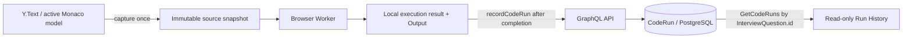

`CodeRun` stores the snapshot in its existing `codeSnapshot` column, maps its existing question relation to the attached `InterviewQuestion`, and derives language from the frozen question snapshot. Its unique primary key uses the Worker-generated `runId` as the idempotency key. The minimal PHASE 10 migration narrows persisted statuses to the Worker terminal states (`SUCCESS`, `RUNTIME_ERROR`, `TIMEOUT`) and adds an index ordered for question history; generic legacy `FAILED`/`ERROR` rows migrate to `RUNTIME_ERROR`. No participant ID or user result is accepted as a trusted identity/value.

The API derives participant identity from the interviewer auth context or verified candidate bearer. Writes require an interview owner/member or candidate session for the same interview, an attached question, an `IN_PROGRESS` interview, JavaScript/TypeScript, bounded source/output/duration and a terminal Worker status. Candidate queries are restricted to their own participant; the owning interviewer sees the interview's history. `codeRuns` accepts limit/offset with default 20 and maximum 50 and sorts newest first by `createdAt`, then `id` for deterministic ties. History is keyed by `InterviewQuestion.id`, not the reusable Question ID.

Output for the just-completed Run stays in local React state and is shown before/during the save request. Apollo receives only the independent persisted query/mutation data; the UI does not optimistically append a run. After a successful mutation it refetches the current history page. If saving fails or the browser is offline, the output remains and shows a separate history-save failure. No offline queue is implemented. History expands read-only source/stdout/stderr and never re-executes old code; there is no restore action.

**A `CodeRun` result is client-reported and is not a trusted judge verdict.** `SUCCESS` says only that the browser reported a Worker completion without a runtime error; a modified client can forge it. The API validates authorization and storage limits but never evaluates user code. This persistence is for interviewer/candidate history only, not scoring or correctness validation.

Sandpack offers an integrated editor-independent live JavaScript/Node preview and supports a richer React project workflow, but introduces a larger runtime/bundler integration than a single-snippet runner needs. [Sandpack](https://sandpack.codesandbox.io/). WebContainers provide an in-browser Node.js filesystem/process environment; they require SharedArrayBuffer/cross-origin isolation, impose browser support constraints and may need a commercial API license. [WebContainers browser support](https://developer.stackblitz.com/platform/webcontainers/browser-support), [WebContainer API FAQ](https://developer.stackblitz.com/guides/user-guide/general-faqs). A first-party Worker is smaller and needs no external service or new package, and its termination API directly meets the infinite-loop requirement. Its narrower language support is why this phase does not claim React TSX execution.

## Границы будущих фаз

| Фаза | Следующий результат                                                                                      |
| ---- | -------------------------------------------------------------------------------------------------------- |
| 0    | Завершён: repository scaffold, strict TypeScript, lint/format, документация и HTTP health                |
| 1    | Завершён: PostgreSQL/Prisma, migrations/seed, Yoga/SDL, services, ownership и реальные integration tests |
| 2    | Реализован: GraphQL Codegen, Apollo/cache, dashboard, library/forms, interview summary и frontend tests  |
| 3    | Реализован: отдельная session, snapshot-at-start, active question и подтверждённый Finish                |
| 4    | Реализован: Monaco Editor, локальные per-question drafts, language/models lifecycle и confirmed Reset    |
| 5    | Реализован: Yjs/WebSocket collaborative editing, per-question rooms, статус соединения и shared Reset    |
| 6    | Реализован: guest invite/session, candidate GraphQL scope и авторизованный Yjs WS handshake              |
| 7    | Завершён: question-scoped presence, Awareness identity, remote cursors/selections и cleanup              |
| 8    | Realtime Session Events                                                                                  |
| 9    | Complete: CSP-restricted browser Code Runner; manual browser smoke passed                                |
| 10   | Implemented: persisted CodeRun history; manual browser smoke pending                                     |
| 11   | Private notes, timeline, finish sequencing и result page                                                 |
| 12   | Дополнение уже созданных тестов: permissions, races, collaboration/reconnect, Apollo behavior            |
| 13   | Docker, CI, окончательный README и проверка полного сценария MVP                                         |

Проверки добавляются вместе с поведением. PHASE 10 добавляет DB-backed authorization/idempotency/pagination cases и frontend coverage для captured snapshots, execution statuses, save failure, read-only history и question scoping. DB-backed suites требуют PostgreSQL и используют выделенные временные test schemas. Durable Yjs persistence, private notes, interviewer authentication, trusted judging и replay остаются будущей работой. PHASE 7–9 manual browser smoke passed; PHASE 10 smoke awaits the user.
