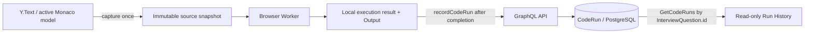

# CodeMeet — PHASE 10: Code Run Persistence and History

**Implementation and manual browser smoke are complete.** Manual browser smoke: **PASS**. The browser Worker remains the only code execution runtime. Completed client-reported results are persisted through GraphQL and shown in a read-only history scoped to the active `InterviewQuestion`.

## 1. Schema decision

The existing Prisma `CodeRun` model already contains the required storage: unique `id`, `interviewId`, reusable `questionId`, `codeSnapshot`, `status`, `stdout`, `stderr`, `durationMs`, optional `createdByParticipantId` and `createdAt`. No new columns or idempotency table were needed. The API accepts the attachment's `InterviewQuestion.id`, resolves it inside the supplied interview, and persists the existing composite interview/question relation. Language is derived from the immutable question snapshot rather than duplicated in the run row.

The migration narrows persisted statuses to the completed states the PHASE 9 controller reports: `SUCCESS`, `RUNTIME_ERROR` and `TIMEOUT`. The old generic `FAILED` and `ERROR` values map to `RUNTIME_ERROR` so existing unsuccessful rows remain readable. It also adds an index for question-scoped newest-first history. The CodeRun table was empty before this migration in the local development database.

## 2. GraphQL API

- `recordCodeRun(interviewId, input)` accepts the Worker `runId`, attachment ID, language, exact source snapshot, terminal status, stdout/stderr and duration.
- `codeRuns(interviewId, interviewQuestionId, limit, offset)` returns an ordered page with `PageInfo`.
- The schema and web operation documents are generated and checked through the existing GraphQL Codegen scripts.
- The API has no execution endpoint and never evaluates or imports user source.

## 3. Authorization model

The API derives the actor from the authenticated identity. The interviewer must own the interview and have its interviewer participant row. A candidate must present a valid, unexpired participant session for that same interview and have the candidate role. The API accepts no `participantId` input. Writes also require an `IN_PROGRESS` interview and an `InterviewQuestion` belonging to it. The owner interviewer can read the interview's runs; a candidate can read only runs whose actor matches their verified participant. A valid actor from another interview is denied.

This preserves the existing temporary demo interviewer identity. It does not provide production multi-user interviewer authentication.

## 4. Snapshot semantics

At the Run click, the editor copies the current Monaco model once. The same primitive source string is sent to the Worker and retained by the completion callback. Persistence uses that captured string; it never re-reads Y.Text after execution. Later edits cannot change the source stored for that run.

## 5. Trust model

**A CodeRun result is client-reported and is not a trusted judge verdict.** `SUCCESS` means only that the browser reported a Worker completion without a runtime error. A modified client can forge status, output, duration and source. The API validates the user's authority and storage bounds, but cannot prove the result or code was actually run. Nothing in this phase scores a candidate or judges correctness.

## 6. Persistence flow

Typing still goes through Yjs/WebSocket. The one persistence mutation happens after a completed execution; normal edits do not call GraphQL.

## 7. Idempotency

The Worker-generated `runId` becomes `CodeRun.id`, which already has a unique constraint. Repeating the same mutation returns the existing row if all logical run data and actor match. Reusing that ID with different data returns `CONFLICT`. No duplicate-key column or optimistic history insertion was added.

## 8. Pagination and order

The service uses the project's offset pagination style with default `limit: 20`, maximum `limit: 50` and a bounded non-negative offset. Results are ordered by `createdAt DESC`, then `id DESC` for deterministic ties. The new composite index follows the interview/question/time/ID lookup order.

## 9. History UI

The compact Run History panel is keyed by the active `InterviewQuestion.id`. It displays status, time, duration and participant display name. Each row expands read-only source, stdout and stderr. It never re-executes old code and has no restore-to-editor action. Switching questions changes query variables and loads only that attachment's history.

## 10. Current Output and persisted history

Current Output remains local React state and appears as soon as the Worker completes. Apollo stores only the server-backed history query and mutation response; there is no optimistic append or local running/log state in Apollo. The UI performs a targeted history refetch after a successful save.

## 11. Save failure and offline behavior

The save request is separate from execution. A failed or offline save leaves the completed Output and its success/runtime-error/timeout status intact, and adds a separate history-save failure message. The UI does not retry automatically, create an IndexedDB/offline queue or turn a persistence error into a runtime error.

## 12. Privacy and storage limits

- `sourceSnapshot` is limited to 100,000 characters.
- Combined stdout and stderr are limited to 20,000 characters; each field is also bounded.
- `durationMs` must be an integer from 0 to 15,000. PHASE 9's Worker deadline remains 5 seconds; the API bound allows browser scheduling delay.
- Only JavaScript and standalone TypeScript are accepted for new rows.
- The service does not log source or output. GraphQL does not accept an actor ID.
- The candidate history response exposes participant display name and role, not user email.
- Browser-reported values are untrusted; these bounds limit storage and do not make them authoritative.

## 13. Tests and final checks

### PASS

- `corepack pnpm check`: Prettier, GraphQL Codegen check, lint and typecheck.
- `corepack pnpm db:validate` and `corepack pnpm db:generate`.
- `corepack pnpm db:migrate`: all four migrations already applied to the local database; no reset was performed.
- Migration deployment against fresh isolated PostgreSQL schemas as part of the API integration suite.
- API/PostgreSQL tests: 9 suites, 121 tests passed. New cases cover exact persistence, all three terminal statuses, auth-derived actor, invalid session, interview/question scope, finished state, limits, idempotent replay/conflict, candidate-only history, owner visibility, newest-first ordering and pagination limits.
- Frontend tests: 18 suites, 142 tests passed. New cases cover saved success/runtime error/timeout, captured source despite later edits, save failure preserving Output, attachment query scope, read-only history details, error/retry controls and output bounds.
- `corepack pnpm build`: production build passed, including the browser Worker bundles.
- `git diff --check` (final result recorded after the last documentation edit).
- Local smoke preparation: API health, GraphQL `health`, `codeRuns`, interview state, dashboard/questions routes and interviewer session route returned successfully.
- Manual browser smoke: PASS for all eight checks listed below.

### FAILED

None in the final verification run.

### SKIPPED

None.

## 14. Manual browser smoke results

Manual browser smoke: **PASS**. The user verified:

1. SUCCESS history — PASS.
2. RUNTIME_ERROR history — PASS.
3. TIMEOUT history — PASS.
4. Immutable snapshot — PASS.
5. Question isolation — PASS.
6. Refresh persistence — PASS.
7. Finish — PASS.
8. Network/Console — PASS.

## 15. Limitations

- The history is an audit/display record of browser claims, not trusted execution evidence.
- Only one source file with JavaScript or standalone TypeScript is supported; imports, packages and React TSX remain unsupported.
- If offline when a run completes, its result is not queued for later persistence.
- Existing TEMP DEMO AUTH does not authenticate a real interviewer account.
- Question code/Yjs document durability across API restart remains outside this phase.

## 16. Technical debt

- Add production interviewer authentication before treating owner history as an account-level permission boundary.
- Define retention/deletion policy for source snapshots and output before production deployment.
- Consider cursor pagination only if history sizes make the current bounded offset paging expensive.
- A first cold root typecheck collided with the existing `db:build` and `db:typecheck` scripts both running Prisma generation into the same ignored output directory. The partial generated client was discarded and regenerated with the existing script; after the root build cache was warm, the final `pnpm check` and `pnpm build` passed without changing Turbo configuration.
- Existing Prisma adapter tests emit a `pg` concurrent-query deprecation warning, and Jest emits the configured Node VM Modules experimental warning; the suites pass.

## 17. State when PHASE 10 closed

When this report was written, PHASE 11 had not started. PHASE 11 is now complete and its Results page provides a descriptive summary and timeline. Trusted judging, server-side execution, hardened sandboxing, scoring, replay, Yjs persistence, production interviewer authentication, restore-old-run and AI review remain out of scope or future work.
