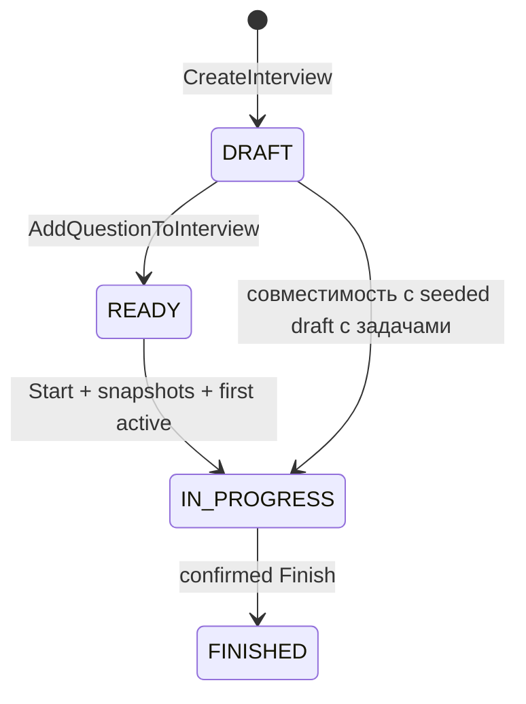

# CodeMeet — PHASE 3 report

Дата: 2 октября 2026. Interview Session Foundation реализована. Commit/push и следующие фазы не выполнялись. Новое задание определяет PHASE 3 как session foundation; прежний план library editing отложен.

## 1. Что реализовано

Flow: Dashboard → Open interview → Start → Open session → выбор active question → read-only условие/код → Finish с подтверждением → summary.

Добавлен отдельный `/interviews/[id]/session`. Summary сохраняет сведения, server status и Start/Finish; Open session появляется для IN_PROGRESS. Session имеет header, ordered question navigation, snapshot content и Finish. После завершения существующий summary показывает сохранённое содержимое; отдельный result route можно добавить позже.

Session доступна по server status: DRAFT/READY показывает «Interview has not started yet», FINISHED — «Interview is finished» и View result. Backend независимо проверяет состояние mutations. Not-found, network error, отсутствие questions/active ID, invalid membership и missing snapshot имеют controlled fallback с диагностическим code/ID и retry/back. Starter code — `<pre><code>`, без editor или execution.

## 2. Database model

На `InterviewQuestion` добавлены nullable fields:

| Поле                | Prisma type          | Назначение                                 |
| ------------------- | -------------------- | ------------------------------------------ |
| snapshotTitle       | String?              | Зафиксированное название                   |
| snapshotDescription | String?              | Условие и requirements                     |
| snapshotDifficulty  | QuestionDifficulty?  | Сложность в момент Start                   |
| snapshotLanguage    | ProgrammingLanguage? | Язык в момент Start                        |
| snapshotStarterCode | String?              | Starter code с исходным whitespace         |
| snapshotCapturedAt  | DateTime?            | Timestamp захвата, одинаковый со startedAt |

Ссылка `questionId` на reusable source, attachment ID и order сохранены. Новая migration `20261002000000_phase_3` additive; старые FK, indexes, CHECK и partial unique constraints не изменены. SQL CHECK требует все шесть non-null либо все шесть null. Пустой starterCode допустим и отличается от отсутствующего snapshot.

Старые IN_PROGRESS/FINISHED записи остаются со snapshots null. Текущая Question не доказывает её историческую версию, поэтому backfill не выполняется. UI не подставляет mutable template вместо missing snapshot. Legacy данные сохранены; тесты проверяют, что reads/seed не придумывают историю.

## 3. Snapshot strategy

`Question` остаётся изменяемым reusable шаблоном библиотеки. `InterviewQuestion` хранит конкретную версию, использованную этим интервью. Session и started/finished summary читают только snapshot fields attachment; `Interview.activeQuestion` используется для идентификации, его mutable title/description/code не служат историческим контентом.

GraphQL SDL расширен шестью flat nullable fields InterviewQuestion; отдельный Snapshot type или JSON response не введён. capturedAt resolver возвращает ISO string. До старта summary использует current Question, после старта — snapshot. UpdateQuestion может продолжать менять reusable source и не затрагивает проведённое интервью.

Snapshot нельзя изменить через application API: отдельной mutation для этого нет; Start повторно запрещён, attachments после Start закрыты. Это application invariant поверх существующих transactions. Прямой administrative SQL не является поддерживаемым write path; completeness CHECK отдельно защищает partial values.

## 4. Почему snapshot создаётся при Start

| Вариант            | Trade-off                                                                                               |
| ------------------ | ------------------------------------------------------------------------------------------------------- |
| При Add            | Рано замораживает подготовку; изменения шаблона до интервью потребовали бы отдельного refresh workflow  |
| При Start — выбран | Включает актуальные данные на момент start transaction, затем сохраняет историю без дальнейшего refresh |

До Start interviewer может исправлять шаблон. Start фиксирует все attachments одновременно: иначе часть задач могла бы получить старую версию, а часть — новую, или status изменился бы без сохранённого контента. Nullable fields отражают подготовку и legacy записи, а не ленивый snapshot при первом открытии session.

## 5. Interview lifecycle

| Операция               | Допустимое состояние | Backend rule                                                                  |
| ---------------------- | -------------------- | ----------------------------------------------------------------------------- |
| AddQuestionToInterview | DRAFT / READY        | Ownership, membership/order uniqueness; первая задача переводит DRAFT в READY |
| StartInterview         | DRAFT / READY        | Минимум одна задача; атомарные snapshots, first active, timestamp, event      |
| SetActiveQuestion      | IN_PROGRESS          | Только attached question; текущая active — no-op без event                    |
| FinishInterview        | IN_PROGRESS          | Status/timestamp и INTERVIEW_FINISHED атомарны                                |

Поддержка DRAFT start сохранена для существующего seed и PHASE 1 regression cases. Repeated Start/Finish дают controlled INVALID_STATE. FINISHED нельзя менять. Remove/reorder API отсутствуют; добавление после Start теперь тоже отвергается. Порядок уже гарантируется backend `order ASC, id ASC` и unique `(interviewId, order)`; эту выборку не переписывали.

## 6. Active question architecture

При Start backend всегда выбирает первую задачу по attachment order, включая legacy preparation record с другим active ID. Frontend не отправляет вторую mutation после Start; успешный response уже содержит IN_PROGRESS, active question и полные snapshots.

Session на входе использует network-only GetInterview для актуального backend state. Active attachment определяется сопоставлением `Interview.activeQuestion.id` с `InterviewQuestion.question.id`. Отдельного `useState(activeQuestionId)` нет. Desktop buttons и native mobile select получают значение из Apollo result.

Click/select вызывает generated SetActiveQuestionDocument. Backend проверяет IN_PROGRESS и membership, записывает active ID и QUESTION_CHANGED. Mutation response нормализуется, меняет highlight и content. UI блокирует конфликтующие actions во время запроса; ref guard закрывает быстрые повторные клики до render loading state. При ошибке остаётся последняя подтверждённая active question и controlled message.

Missing/foreign active ID на mobile показывает placeholder, а не визуально выбранную первую option; пользователь может восстановить выбор разрешённой задачей. Missing snapshot не заменяется source data; такая question disabled. Finish остаётся доступным для завершения интервью с broken content.

## 7. Transaction boundaries

Используется прежняя Serializable strategy с максимум тремя попытками при P2034, без нового transaction abstraction.

Start transaction: validate owner/status/nonempty ordered attachments → copy current Question fields для каждого attachment → first active → IN_PROGRESS/startedAt → INTERVIEW_STARTED → read response. Все capturedAt равны одному startedAt. Ошибка snapshot/status/event откатывает всю transaction; повторный Start не перезаписывает содержимое. Concurrent Add/Start либо включает добавление до start с полным snapshot, либо отклоняет добавление после start.

SetActive transaction: validate owner/IN_PROGRESS → membership → no-op check → conditional active ID update → QUESTION_CHANGED → read response. Payload остаётся минимальным `{ questionId, previousQuestionId }`; snapshot в event не дублируется. Membership дополнительно защищён composite FK. SQL отказ event insertion откатывает active ID.

Finish сохраняет существующие conditional status update, finishedAt и INTERVIEW_FINISHED в одной transaction. Client confirmation не заменяет backend guard. Snapshot/content immutability независима от наличия frontend disabled button.

## 8. Apollo cache и Codegen

SDL — прежний единственный source of truth. InterviewFields выбирает новые snapshot fields; добавлена одиннадцатая domain operation SetActiveQuestion. Codegen обновил TypedDocumentNode artifacts. Hook results/variables и props выводятся из generated documents/fragments; ручных response interfaces нет. `question-snapshot.ts` возвращает проверенный content из generated attachment type.

Стандартная normalization `__typename:id` действует и для InterviewQuestion. Mutable Question и snapshot поля принадлежат разным normalized records; обновление Question не заменяет captured fields attachment.

| Mutation          | Cache update                                                                                                          |
| ----------------- | --------------------------------------------------------------------------------------------------------------------- |
| StartInterview    | Полный InterviewFields нормализует active/status/timestamps/snapshots; interviews lists evict из-за status membership |
| SetActiveQuestion | Полный InterviewFields автоматически обновляет active reference и session; без list eviction/full refetch             |
| FinishInterview   | Нормализует FINISHED/timestamp, evict только interviews lists; session redirect в summary                             |

Dashboard сохраняет свой targeted refetch после status actions. Filter-aware pagination и остальные PHASE 2 strategies не изменены. Browser smoke подтвердил, что при switch не появился дополнительный GetInterview request.

## 9. Optimistic update decision

Optimistic response не добавлен. Для MVP выбран подтверждённый backend selection с коротким pending state, disabled navigation/Finish и явной ошибкой. Это позволяет обойтись без rollback/queue при быстрых переключениях и сохраняет единый authoritative active ID.

Позже optimisticResponse можно добавить с generated shape и Apollo rollback, когда появится измеренная потребность; текущая архитектура этому не мешает. Start/Finish business statuses не вычисляются frontend.

## 10. Frontend architecture

Server route wrapper `/interviews/[id]/session/page.tsx` передаёт id в client feature. Root layout/provider boundary PHASE 2 сохранены, queries имеют `ssr: false`; SSR или новый Apollo integration package не добавлялись.

- InterviewSessionPage — query, mutations, access/broken states и pending/errors/dialog.
- InterviewSessionHeader — title, server status, started time, Finish.
- InterviewQuestionList — ordered buttons/active state и mobile select.
- ActiveInterviewQuestion — snapshot metadata, description с line breaks и read-only code.
- FinishInterviewDialog — native modal confirmation, Cancel/Confirm, error/pending.
- question-snapshot helper — проверка полноты шести nullable fields; пустой code корректен.

Desktop имеет sidebar/content; до 1050px question navigation становится select. App shell сохраняет собственный responsive layout. При 320px нет узкой IDE grid; code scroll локален. Новые CSS находятся рядом с существующими workspace styles, без design system.

Native `<dialog>.showModal()` делает background inert; labels и Cancel initial focus заданы явно. Pending запрещает cancel/повторный confirm; Escape закрывает диалог без mutation, после закрытия focus возвращается к Finish. Проверено в реальном Chrome. [MDN: native dialog accessibility](https://developer.mozilla.org/en-US/docs/Web/HTML/Reference/Elements/dialog#accessibility)

## 11. Backend tests

**83/83 PASS, 2 suites:** исходные 47 integration + 20 CORS + 16 новых PHASE 3 cases. Prisma не мокается. Existing TEST_DATABASE_URL strategy создаёт isolated `cm_test_<uuid>` schema, применяет обе migrations, seed и выполняет cleanup. Test database infrastructure не менялась.

Покрыты все 12 требуемых категорий: Start snapshots; current Question data; source edit после Start не меняет snapshot; first active; membership; stable order; post-start Add запрещён; QUESTION_CHANGED; switching только IN_PROGRESS; FINISHED immutable; atomic snapshot/status/event; repeated Start controlled error.

Дополнительно: snapshots отсутствуют при подготовке; legacy preselected active уступает первой по order; concurrent Add/Start; same-active no-op; active/event rollback; legacy IN_PROGRESS/FINISHED reads/seed сохраняют null; real SQL CHECK отвергает partial snapshot. Existing Start rollback test расширен до двух attachments и проверяет сохранение обоих прежних rows.

Все прежние case names и regression assertions сохранены. Один fixture старого membership/event test теперь сначала Start с двумя attachments, затем unattached third и actual switch: pre-start switching больше не является разрешённым контрактом. Проверки не удалялись ради изменения lifecycle.

## 12. Frontend tests

**48/48 PASS, 6 suites:** прежние 21 + 27 новых session/history cases. Jest, RTL и MSW GraphQL handlers используют настоящий Apollo client/cache/HttpLink; hooks и private cache internals не мокируются. Fixtures выводятся из generated operation types.

Все 12 требуемых behaviors: active content, правильный order, switch mutation, controlled error, highlight, READY gate, FINISHED gate, missing interview, confirmation, Finish redirect, Finish error остаётся в session, usable mobile select.

Дополнительно: DRAFT, unavailable API, missing/foreign active, empty questions, каждое missing snapshot field, valid empty code, immutable session/FINISHED summary после source edit, switch без query refetch/optimism, repeated-action protection, cancel без Finish и правильный mobile placeholder. Code whitespace проверяется точно в read-only pre.

JSDOM получает минимальный showModal/close polyfill только для отсутствующих native methods. CSS и реальные modal focus/inert semantics проверены browser smoke, а не объявлены проверенными через jsdom.

## 13. Browser smoke

PASS на production Next.js + compiled Yoga API с TEMP DEMO AUTH + реальном PostgreSQL. Создана новая question, затем interview с двумя задачами. Dashboard Open открыл summary; direct READY session показала not-started state. Start создал snapshots/first active, Open session загрузил workspace. Desktop switch обновил content/highlight без GetInterview refetch и сохранил QUESTION_CHANGED с предыдущим/новым IDs.

Реальный generated UpdateQuestion изменил reusable title/description/difficulty/language/code после Start. После reload session сохранила исходный snapshot; GraphQL отдельно вернул изменённый source и прежние captured fields. Post-start attachment получил INVALID_STATE.

Проверены 1440/1280/768/390/320px: нет document horizontal overflow, mobile select видим и меняет серверную active question. Confirmation проверена keyboard Tab/Shift+Tab, Escape, focus return и blocked background focus; cancel не отправляет Finish. Confirm выполнил Finish и redirect в FINISHED summary. Direct finished session показывает View result без рабочих actions.

PostgreSQL подтверждает IN_PROGRESS/FINISHED, одинаковый snapshotCapturedAt/startedAt, first ordered active, один STARTED и один FINISHED event. Browser GraphQL responses имеют HTTP 200 и explicit CORS; page exceptions отсутствуют. MSW в smoke не используется.

In-app Browser недоступен: connection/discovery проверены, список пуст. Использован установленный headless Chrome с fresh profiles и временным Playwright вне repo. Screenshot capture проверяется визуально; отдельные fresh viewport contexts используются для стабильных responsive captures.

Screenshots: [desktop](screenshots/session-desktop.png), [tablet](screenshots/session-tablet.png), [mobile](screenshots/session-mobile.png), [Finish confirmation](screenshots/session-finish-confirmation.png), [finished summary](screenshots/session-finished-summary.png).

## 14. Checks

Окружение: Node 22.23.3, pnpm 10.34.6, native PostgreSQL 17.10, установленный Chrome. Dependencies не добавлялись и не обновлялись. Docker CLI/engine отсутствует; Compose не запускался, database checks используют ту же PostgreSQL major version.

| Проверка                                                   | Результат                                                                                  |
| ---------------------------------------------------------- | ------------------------------------------------------------------------------------------ |
| `pnpm format`, `pnpm format:check`                         | PASS                                                                                       |
| Root `pnpm check`: lint + strict typecheck + Codegen check | PASS                                                                                       |
| `pnpm graphql:codegen`                                     | PASS: 11 TypedDocumentNode operations                                                      |
| `pnpm graphql:codegen:check`                               | PASS через root check и production build                                                   |
| Frontend Jest/RTL/MSW                                      | PASS: 48 tests, 6 suites                                                                   |
| Backend real PostgreSQL integration/CORS                   | PASS: 83 tests, 2 suites                                                                   |
| `pnpm build`                                               | PASS: web, API, db; новый dynamic session route                                            |
| `pnpm db:validate`, `pnpm db:generate`                     | PASS                                                                                       |
| `pnpm db:migrate`                                          | PASS: PHASE 3 migration applied к локальной DB                                             |
| `pnpm db:seed`                                             | PASS: idempotent seed; existing data сохранены                                             |
| GraphQL smoke                                              | PASS: snapshots/lifecycle/switch/source mutation/guard через настоящие generated documents |
| Browser/responsive/keyboard smoke                          | PASS: полный flow и пять viewport widths                                                   |

Итого **131 tests, 8 suites PASS**. Observed upstream ESLint/pg/Jest warnings PHASE 1–2 не скрывались; их compatibility debt не расширяет PHASE 3. Credentials остаются вне repository; actual `.env` не создавался, app URLs берутся из environment. Temporary verification servers останавливаются после проверки.

## 15. Technical debt

- Legacy snapshots не могут быть достоверно восстановлены из mutable source; при наличии внешней исторической версии потребуется отдельная explicit import policy.
- TEMP DEMO AUTH сохраняет прежние ограничения; настоящие sessions/guest access принадлежат следующему заданию.
- Без realtime external status/active changes видны при следующем запросе; server guards защищают каждую mutation. Version/expectedVersion/idempotency пригодятся при multi-client workflow.
- Full InterviewFields возвращает все attachments и два набора source/snapshot content. При росте данных следует разделить lightweight list/status/switch selections и определить query cost/cardinality limits.
- Snapshot invariant реализован application service; SQL CHECK защищает completeness, но не запрещает целиком заменять row административным SQL. Поддерживаемого write API для этого нет.
- Partial create recovery после reload и unknown CreateInterview response остаются долгом PHASE 2; этот workflow не переписывался.
- Реальный browser QA выполнен в Chrome; дополнительная cross-browser verification и полноценная CI/browser automation остаются инфраструктурной задачей.

## 16. Что остаётся следующему PHASE

Только по отдельному заданию: настоящая auth/guest flow, дальнейшие library UX/details/editing, отдельный result route с runs/notes/timeline и специализированные editor/realtime фазы. Snapshot content уже готов быть источником начального code document, но CodeDocument/Monaco/Yjs implementation не добавлялась.

Monaco, WebSocket, Yjs, presence, guest join, Auth.js, runner/Sandpack/WebContainers и collaborative editing не начаты. PHASE 3 завершает работу этого запроса. Commit и push не выполнялись.
